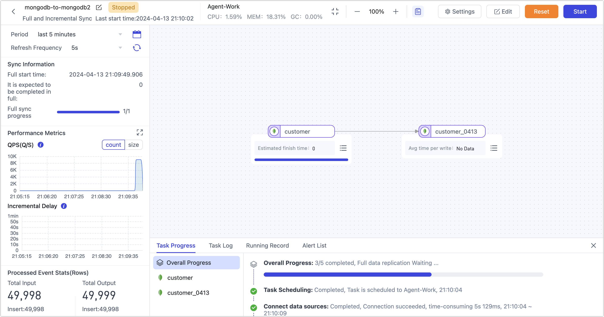

# Ensure Data Migration with Breakpoint Continuation

import Content from '../reuse-content/_all-features.md';

<Content />

In scenarios involving massive data migration, you can utilize Tapdata's full resumption from breakpoint feature to segment and migrate data, enhancing the reliability of data migration and ensuring successful execution of migration tasks.

## Scenario Description

As businesses grow and data volumes continuously increase, data storage and management have become core issues for enterprise development. Data migration, as a common data management approach, is widely used across various domains such as cloud computing, big data analytics, backup, and recovery. However, due to large data volumes, long duration, unstable network environments, and equipment failures, data transmission tasks may interrupt, leading to task failures.

To address this issue, Tapdata introduces the full resumption from breakpoint functionality, which segments massive data from the source database and records the amount and progress of transmitted data. In subsequent data migration processes, each data segment is temporarily stored in Tapdata’s local cache. Then, it merges with the related incremental data changes before being sent to the target database, achieving resumption from breakpoints and ensuring data accuracy. This effectively avoids data loss and task failures due to data transmission interruptions, enhancing the reliability and efficiency of data migration.

## Prerequisites

* The full resumption from breakpoint is currently only supported for MongoDB data sources, i.e., the source database must be MongoDB.
* Before creating a data transformation task, ensure you have configured the relevant data sources, see [Configuring MongoDB Connection](../prerequisites/on-prem-databases/mongodb.md) for details.

## Procedure

In this case, we will demonstrate the specific configuration process for data migration between MongoDB instances.

1. [Log in to the Tapdata platform](../user-guide/log-in.md).

2. In the left navigation bar, select **Data Pipeline** > **Data Replication**.

3. Click **Create** on the right side of the page.

4. Drag the MongoDB data sources acting as the source and target databases to the right-side canvas, then connect them.

5. Click on the node corresponding to the source database and complete the right-side panel configuration as instructed below.

   

    * **Basic Settings**
        * **Node Name**: Default is the connection name; you can also set a business-meaningful name.
        * **Select Tables**: Choose based on business needs.
            * **Select by table name**: Select the table on the left, and then click the right arrow to complete the setup.
            * **Match regular expressions**: Enter the regular expression for the table name. Additionally, when a table is added to the source database and it matches the specified expression, Tapdata will automatically synchronize the table to the target database.
            * **Selectable table range**: By default, all tables are displayed, but you can choose to filter only tables with primary keys or only tables without primary keys. Since tables without primary keys use the full primary key method to implement data updates, they might encounter errors due to exceeding the index length limit, and their performance might be limited. Therefore, it is recommended that you create separate data replication tasks for tables without primary keys to avoid task errors and enhance the performance of data updates.
        
    * **Advanced Settings**
        * **DDL Synchronization**: Enabling this switch allows Tapdata to automatically collect selected source DDL events (such as adding fields), and if the target end supports DDL writing, it can synchronize DDL statements.
        
        * **Incremental Method**      
            Choose **Log CDC** or **Polling**. If you select **Polling**, you'll also need to specify the polling field, interval, and number of rows read each time.
        
            **Log CDC** will use the data source's transaction log to parse and sync incremental events. **Polling** will sync incremental events by polling a field, but it often can't sync delete events.      
        
        * **Data Filter**      
        
            * **Fully Customizable Query**: Turn this on to input a custom SQL query for full data sync (doesn't affect the incremental stage). For example, `SELECT id,name,address FROM customer;`.
              :::tip
              To use this feature, the target node must be a weak Scheme type of data source (like MongoDB/Kafka) etc.
              ::: 
            * **Filter Settings**: Off by default. Turn it on to specify data filtering conditions.     
        
        * **Full Breakpoint Resume**: This feature is suitable for migration scenarios with data sizes reaching billions. When enabled, after stopping the task, you can continue migration from the breakpoint next time.
          
            * **Sharding Method**: Choose based on business needs:
                * **Sharding Based on Count**: Based on the number of records, you need to specify the size of the partition.
                * **Sharding Based on min/max**: Based on maximum/minimum values, you need to specify the number of partitions.
            * **Shard Size**: Choose the record number in each shard.
            * **Sharding Concurrency Thread Count**: Choose the concurrency based on the source database and Tapdata server load, default is 8.
            * **Sharding Batch Read Limit**: Choose the upper limit of batch read data per partition based on source database load, default is 3000.
            * **Shard Batches and Incremental Data are Merged Locally Before Sending**: If this task needs to perform both full and incremental migration, keep it enabled. If only full migration is performed and the source database will not change data during migration, you can disable this feature.
            
        * **Data Source Exclusive Configuration**
          Choose whether to **Disable Cursor Timeout** (default off) and **Supplement Update Data with Complete Fields** (default on).
        
    * **Data Model**
      Display the source table structure information, including field names and field types.
      
    * **Alert Settings**
      By default, if the node's average processing time continuously exceeds 5 seconds for 1 minute, system notifications and email alerts will be sent. You can adjust the rules or turn off alerts based on business needs.

6. Click on the target endpoint node and complete the parameter configuration on the right-side panel as instructed below.

   

    * **Basic Settings**
      
        * **Node Name**: Defaults to connection name, you can also set a name that has business significance.
        
        * **Table**: Select a destination table to write, or you can also manually fill in a table that will be automatically created if it does not exist. Additionally, you can directly click on the target's automatic field type in the pop-up dialog to adjust the field type and precision.
        
        * **Update Condition Field**: Select the field on which the update condition is determined.
        
        * **Duplicate Processing Strategy**: Choose how duplicate data should be handled.
        
        * **Number of Writes Per Batch**: The number of entries written in each batch during full data synchronization.
        
        * **Write the Maximum Waiting Time for Each Batch**: Set the maximum wait time in milliseconds, based on the performance of the target database and the network delay evaluation.
        
        * **Full Multi-threaded Write**: The number of concurrent threads for writing full data is set to the default value of **8**. You can adjust this value based on the write performance of the target database.
        
        * **Incremental Multi-threaded Write**: The number of concurrent threads with incremental data written, which is disabled by default, can be appropriately adjusted based on the write performance of the target database.
        
        * **Model**: Displays the table structure information of the target table, including the field name and field type.
        
        
        * **Node Name**: Default is the connection name; you can also set a business-meaningful name.
        * **Table**: Displays the table structure information that Tapdata will write to the target endpoint, deduced based on the settings of the source endpoint node. It automatically sets the update condition to the table's primary key. If there is no primary key, you must manually specify the fields for the update condition.
        
    * **Advanced Settings**
      
      * **Data write mode**: Keep the default, or select according to business needs.
         * **Process by Event Type**: After selecting this item, you also need to select the data write policy for inserts, updates, and deletes events.
         * **Statistics Additional Write**: Handles only insert events, discards updates, and deletes events.
      * **Data Source**: Select whether to synchronize the index.
      
    * **Alert Settings**
         If the average processing time of nodes exceeds 5 seconds continuously for 1 minute, Tapdata will send out notifications and email alerts by default. You can further customize these rules or choose to turn off alerts based on your specific business needs.
   
7. (Optional) Click the **Settings** button in the upper right corner of the page to configure the task properties.

    * **Task Name**: Enter a business-meaningful name.
    * **Synchronization Type**: You can choose **Full + Incremental**, or select **Full** or **Incremental** separately.
      Full means copying the existing data from the source endpoint to the target endpoint, and Incremental means copying new data or data changes from the source endpoint to the target endpoint in real-time, both combined can be used in real-time data synchronization scenarios.
    * **Task Description**: Enter a description for the task.
    * **Advanced Settings**: Set the start time of the task, shared mining, incremental data processing mode, processor thread count, Agent, etc.

8. Click **Save** or **Start** to complete the creation. To ensure the normal operation of the task, Tapdata will perform a pre-check based on node configurations and data source characteristics, while also logging information.

   :::tip

   If the pre-check fails, adjust according to the log prompts on the current page. For more information, see [Task Pre-Check Explanation](../user-guide/data-pipeline/pre-check.md).

   :::

9. After successful startup, you will automatically be redirected to the task monitoring page, where you can view the task's QPS, delay, task events, and more.

## Full Resumption from Breakpoint Verification

During the operation of the task, click the **Stop** button in the upper right corner of the task monitoring page to pause the task; the progress of the full migration still exists.

At a low business peak, you can restart the task to continue the previous full migration. You can also edit the task by clicking the settings at the top of the page to set the scheduled start time of the task.