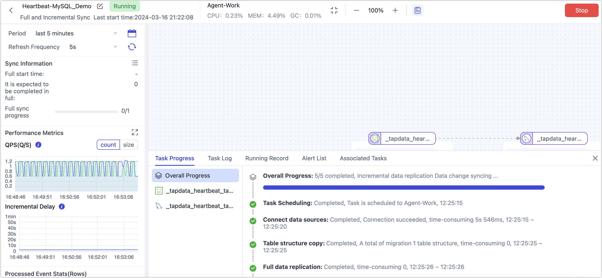

# Monitor Data Synchronization with Heartbeat Tables

Tapdata uses heartbeat tables to write timestamp information to the source database every **10 seconds**. By checking the timestamp information in the heartbeat tables, we can quickly determine the activity and health of the data source, thereby better monitoring the data synchronization path and ensuring the stability and reliability of the data synchronization path.

## Applicable Scenarios

* If the source database often has long periods without DML operations (such as data insertion), and you need to quickly determine the status of incremental tasks through the **Incremental Checkpoint** in the **Task List** to ensure the link status and incremental log acquisition are normal.

  

* If the source database has many DML operations, it is necessary to prevent the incremental logs recorded by Tapdata from being archived and deleted, which would make it impossible to obtain the incremental checkpoint.

## Considerations

* Since the heartbeat table function needs to automatically create the table and update the timestamp in the source database, ensure the database account has the necessary permissions before enabling. For example, in MySQL, ensure the account has **CREATE**, **INSERT**, and **UPDATE** permissions. For more on permissions, see [Data Source Preparation](../prerequisites/README.md).
* The heartbeat table is named **_tapdata_heartbeat_table**. Ensure the integrity and reliability of the heartbeat table data and avoid operations on it in the source database (such as deleting the table).

## Enabling Heartbeat Tables for a Data Source

1. [Log in to the Tapdata platform](../user-guide/log-in.md).

2. In the left navigation bar, click **Connection Management**.

3. Find the created data source and click **Edit** in the **Actions** column.

   If setting this up during the creation of a new data source, the method is the same. For more information, see [Connecting Data Sources](../prerequisites/README.md).

4. Scroll down to the bottom of the page and turn on the heartbeat table switch.

   

   :::tip

   If you do not see this switch, check the **Connection Type** setting on the page to ensure it is set to **Source and Target**. Additionally, some data sources do not support being used as both source and target. For more information, see [Supported Data Sources](../introduction/supported-databases.md).

   :::

5. Click **Save**.

## Viewing Heartbeat Table Tasks

Once the heartbeat table is enabled for a data source, the heartbeat task will start only after the data source is referenced and started in a data replication/development task. At this point, you can re-enter the edit page for that data source and click **View Heartbeat Task**.



As shown above, Tapdata uses a Dummy data source to write a timestamp to the source database every 10 seconds, thus continuously updating the incremental checkpoint and better monitoring the data source and link status.

## Common Questions

* **Q: Can I delete or edit the heartbeat table task?**

  **A:** No, you do not need to manually operate it. The heartbeat table task will automatically stop once all tasks associated with that data source are stopped. If that data source is deleted, the heartbeat task will also be automatically deleted.

* **Q: What are the structure and data contents of the heartbeat table?**

  **A:** For example, in MySQL, the table structure and data are as follows:

  ```sql
  -- View heartbeat table structure
  DESC _tapdata_heartbeat_table;
  
  -- Result
  +-------+-------------+------+-----+--------------------------+-------+
  | Field | Type        | Null | Key | Default                  | Extra |
  +-------+-------------+------+-----+--------------------------+-------+
  | id    | varchar(64) | NO   | PRI | 641a726eb1837461c70caa9d |       |
  | ts    | datetime(6) | YES  |     | NULL                     |       |
  +-------+-------------+------+-----+--------------------------+-------+
  
  -- View heartbeat table data
  SELECT * FROM _tapdata_heartbeat_table;
  
  -- Result
  +--------------------------+----------------------------+
  | id                       | ts                         |
  +--------------------------+----------------------------+
  | 6438cdbef713082e37eb0a05 | 2023-04-14 04:03:28.963000 |
  +--------------------------+----------------------------+
  ```