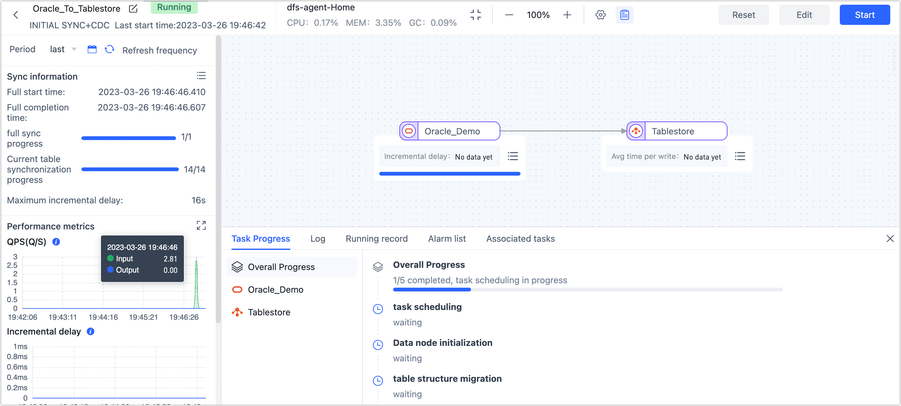

# Oracle to Tablestore Real-Time Sync

[Alibaba Cloud Tablestore](https://www.alibabacloud.com/help/en/tablestore) is a serverless table storage service designed for handling large volumes of structured data. It also provides a comprehensive solution for IoT scenarios, offering optimized data storage capabilities. Tapdata Cloud enables real-time synchronization of Oracle data to Tablestore, providing seamless data flow and facilitating easy adaptation to data architecture changes and big data analysis scenarios.

## Preparations

Before you create a replication task, make sure you have configured the relevant data source:

1. [Configure Oracle Connection](../prerequisites/on-prem-databases/oracle.md)
2. [Configure Tablestore Connection](../prerequisites/warehouses-and-lake/tablestore.md)

Also note the reference [data type support](../user-guide/no-supported-data-type.md).

## Configure Task

1. Log in to [Tapdata Cloud](https://cloud.tapdata.io/).

2. In the left navigation panel, click **Data Replications**.

3. On the right side of the page, click **Create** to configure the task.

4. Drag and drop the Oracle and Tablestore data sources from the left side of the page onto the right canvas. Once they are placed, you can connect them by drawing a line or arrow between the two data sources.

5. Click on the Oracle data source, choose the desired table in the right panel, and then click on the Tablestore data source to view the synchronized data structure.

   

   :::tip

   Since the number of columns in a single table in Tablestore cannot exceed 32, if the number of columns in the Oracle tables to be synchronized exceeds 32, you can address this limitation by adding a **Field Edit** node between the Oracle and Tablestore data sources. This node allows you to handle the situation and selectively exclude business-independent columns from the synchronization process. For more information, see [Processing Node](../user-guide/data-development/process-node.md).

   :::

6. After confirming the configuration is correct, click **Start**.

   After the operation is completed, you can observe the performance of the task on the current page, such as QPS, delay, task time statistics, etc.

   

## Task Management

On the Task List page, you can also start, stop, monitor, edit, copy, reset, and delete tasks.

For more information, See [Management Tasks](../user-guide/copy-data/manage-task.md).