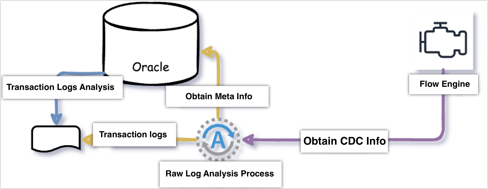

# Deploy Oracle Raw Log Parsing Service
import Content from '../reuse-content/_enterprise-and-cloud-features.md';

<Content />

To enhance the efficiency of capturing data changes, Tapdata supports not only using the native log parsing tools of databases (LogMiner) but also has developed the capability to directly parse the incremental log files of the database. This allows for more efficient event capture, achieving higher data collection performance (QPS over 20,000), reducing the impact on the source database during incremental data collection, but it requires the deployment of an additional component, which increases operational costs, making it suitable for scenarios with frequent data changes.



## Environment Requirements

* **Database**: Supports versions 11g, 12c, 18c, 19c, 21c.
* **Operating System**: Linux 64 or Windows 64 platforms.
* **Storage**: Supported file systems include ext4, btrfs, zfs, xfs, sshfs; supported database block sizes are 2k, 4k, 8k, 16k, 32k.
* **Port Requirements**: Some server ports must be open for service communication, including: default data transfer port: **8203**, web management default port: **8303**, raw log service port: **8190**.
* **Permission**: The operating system user running the raw log plugin must have read access to redo log files; in addition to the permissions required for the source database as per the [Oracle Preparation Work](../../prerequisites/on-prem-databases/oracle#source) and enabling archive logs, additional permissions must be granted to simulate Oracle's data information structure and processes to cache part of Oracle Schema information to support the parsing of redo logs.

```sql
-- Replace <DSTUSER> with the actual username
GRANT SELECT, FLASHBACK ON SYS.CCOL$ TO <DSTUSER>;
GRANT SELECT, FLASHBACK ON SYS.CDEF$ TO <DSTUSER>;
GRANT SELECT, FLASHBACK ON SYS.COL$ TO <DSTUSER>;
GRANT SELECT, FLASHBACK ON SYS.DEFERRED_STG$ TO <DSTUSER>;
GRANT SELECT, FLASHBACK ON SYS.ECOL$ TO <DSTUSER>;
GRANT SELECT, FLASHBACK ON SYS.OBJ$ TO <DSTUSER>;
GRANT SELECT, FLASHBACK ON SYS.SEG$ TO <DSTUSER>;
GRANT SELECT, FLASHBACK ON SYS.TAB$ TO <DSTUSER>;
GRANT SELECT, FLASHBACK ON SYS.TABCOMPART$ TO <DSTUSER>;
GRANT SELECT, FLASHBACK ON SYS.TABPART$ TO <DSTUSER>;
GRANT SELECT, FLASHBACK ON SYS.TABSUBPART$ TO <DSTUSER>;
GRANT SELECT, FLASHBACK ON SYS.USER$ TO <DSTUSER>;
GRANT SELECT ON SYS.V_$ARCHIVED_LOG TO <DSTUSER>;
GRANT SELECT ON SYS.V_$DATABASE TO <DSTUSER>;
GRANT SELECT ON SYS.V_$DATABASE_INCARNATION TO <DSTUSER>;
GRANT SELECT ON SYS.V_$LOG TO <DSTUSER>;
GRANT SELECT ON SYS.V_$LOGFILE TO <DSTUSER>;
GRANT SELECT ON SYS.V_$PARAMETER TO <DSTUSER>;
GRANT SELECT ON SYS.V_$STANDBY_LOG TO <DSTUSER>;
GRANT SELECT ON SYS.V_$TRANSPORTABLE_PLATFORM TO <DSTUSER>;
```

:::tip

You need to log in database as **SYS** user, and grant the above permissions to the database user. If the database has enabled multi-tenant capabilities, users must be created and granted permissions within the PDB.

:::

## Procedure

Next, we'll demonstrate the deployment process for raw log querying using Oracle 12c running on a Linux platform as an example.

1. [Contact Tapdata](mailto:team@tapdata.io) to obtain the installation package and License file for the raw log parsing plugin.

2. Log into the device hosting Oracle, and execute the following commands to prepare for deployment.

    1. Upload the installation package to the /home directory, then execute the following command to unzip it.

       ```bash
       tar -xvf {installation package file}
       ```

    2. Execute the following command to prepare the environment and start the frontend deployment page.

       ```bash
       # Using the 12c version component installation package as an example
       bash setup_linux64_12c.sh
       ```

       Follow the command-line prompts, choose Oracle database as the source (enter `s`), then fill in the username, password, installation directory, and Oracle environment file. After setting up, you will be prompted to access the web deployment page through port **9099**, as shown below:

       

    3. Place the License file in the `conf` directory of the plugin installation directory.

       In this example, based on the command prompt, we installed the plugin in `/home/fzs_tapdata`, so the License file should be placed in `/home/fzs_tapdata/conf`.

3. Access the deployment page via a web browser, confirm the environment variables and License are correct, then click **Next**.

   Assuming the service address of Oracle is `192.168.1.18`, the access address would be: `http://192.168.1.18:9099/`.

   

4. Read the installation instructions, common questions, the list of unsupported objects, and database hidden parameter checks, then click **Next**.

5. Fill in the database connection user and perform a check. A prompt that the **user exists** indicates the check passed, then click **Next**.

6. Select the synchronization mode; in this example, we choose **User-level Synchronization Mode** and click **Next**.

    * **User-level Synchronization Mode**: Select the Schemas to synchronize in subsequent steps, manually enter tables to exclude, suitable for scenarios where there are many tables in the Schema.
    * **Table-level Synchronization Mode**: Select the tables to synchronize in subsequent steps, suitable for scenarios with fewer tables in the Schema.
    * **Database-level Synchronization Mode**: Synchronize the entire database, manually enter Schemas to exclude in subsequent steps, suitable for scenarios with many Schemas to synchronize.
   
7. Select the Schemas to synchronize and click **Next**.

   

8. (Optional) Based on the page prompts, enter the Schemas to synchronize, tables to exclude, and priority large tables to sync, then click **Next**.

9. Based on the page prompts, set the target ID and the number of concurrent full synchronizations, where the number of concurrent operations ranges from 1 to 8, then click **Next**.

10. Follow subsequent steps as needed, keeping default settings and click **Next** if there are no special requirements.

11. Return to the command line on the device, execute the raw log startup script from the run directory corresponding to the Oracle version, for example, Oracle 12c version, execute `bash fzstrack12c`.

    The command line prompt `java server started, wait for java client cmd...` indicates the service has started properly.

## Next Steps

When [configuring an Oracle connection](../prerequisites/on-prem-databases/oracle.md), choose the log plugin as **bridge** and then enter the IP address of the raw log service, with the default service port being **8190**.

## Common Questions

* **Q: What files does the raw log plugin primarily read?**

  **A:** It mainly reads Oracle's redo log logs.

* **Q: What resources does the raw log plugin occupy?**

  **A:** If the storage medium is **local disk**, redo logs are stored on the local disk, and the log analysis module usually communicates with Oracle only a few times when a new log analysis task starts. DML and DDL data are obtained by reading the binary of the redo log files locally, which does not use Oracle's performance, but since it is deployed on the same machine as Oracle, it will use some disk I/O, CPU, memory, and network bandwidth.

  If the storage medium is **ASM**, redo logs are saved inside the ASM. In this case, DML and DDL data come from querying the ASM instance remotely to get the binary of redo logs, so it will use some ASM performance. Here, the program does not have to be on the same machine as Oracle, so it will use some network bandwidth and ASM performance.

* **Q: What happens if you forcefully terminate the Tapdata engine or raw log plugin?**

  **A:** The system will rescan the directory for accumulated fzs files, which may cause a slow entry into incremental mode. If an anomaly occurs, you can save the related parsing logs to provide to technical support.

* **Q: How to restart the raw log plugin service?**

  **A:** Enter the `run` directory and execute the following commands in sequence.

  ```bash
  ./fzsstop
  ./fzsweb -sq
  ./fzsweb -s
  ./fzsstart
  ```