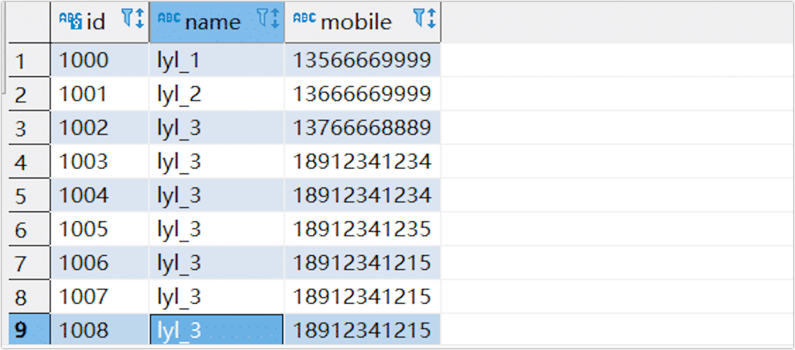

# Manage Shared Mining

To alleviate the pressure on the source database during increments, Tapdata Cloud supports shared mining of incremental logs. Once the mining feature is activated, it will not start mining immediately. Instead, it begins when the user creates a task for the table belonging to that data source. Regardless of whether the mining task is paused or encounters errors, it will not affect the normal operation of the synchronization task.

## Enable Shared Mining

You can enable Shared Mining when [creating a connection](../../prerequisites/README.md), which allows for the collection of the source database's incremental logs into external storage. Once enabled, these logs can be used by multiple tasks, eliminating the need for redundant reads of the source database's incremental logs.

## Use Shared Mining

Create a data transformation or data replication task. When the task contains incremental tasks and the data source has shared mining enabled, you can use the shared mining feature in the task settings. For more introductions about task configuration, see [creating data replication/transformation task](../../quick-start/create-task.md).

## Manage Shared Mining

Upon successful task creation, a mining task is automatically generated. In [Tapdata Cloud](https://cloud.tapdata.io/), navigate to **Advanced** > **CDC Log Cache** from the left menu. Here, mining names are prefixed with the **data source name**, aiding in quick identification:

The manageable actions are as follows:

* **Stop Shared Mining Task**: Click **Stop** when you no longer need to execute the shared mining task or need to adjust configurations.

* **Edit Shared Mining Configuration**: Click **Edit** when the shared mining task is stopped, and then set the mining name, log save duration, and mining start time in the pop-up dialog box.
  
  

* **Monitor Task Details**: Click **Monitor** corresponding to the mining task to view detailed mining information, such as QPS, incremental delay, and other key indicators.
  
  

* **Configure Task Alerts**: Click **Monitor** corresponding to the mining task, click the settings in the upper right corner of the page, and in the panel that pops up on the right, configure task alerts. You can send alert messages via system notification messages or emails to better grasp the task's running status.
  
  

* **Start/Stop Mining Task for Specified Tables**: Click <b>Monitor</b> corresponding to the mining task, then click on the source node. In the panel on the right of the page, you can see information about the tables involved in shared mining and the quantity being mined, as shown below.
  
  
  
  When encountering a table that triggers an incremental event exception due to a large transaction, you can select the relevant table on this page and click **Stop Mining**. Confirm the impact scope in the pop-up dialog box and click **OK**.
  
  After subsequently completing the large transaction submission processing, click on the **Stopped Mining** tab, select the target table, and click **Resume Mining**.

## Application Scenario

Suppose you want to create a synchronization task from MySQL to Oracle but want to implement it through shared mining to relieve the pressure on the source database.

First, create a MongoDB as a middle repository for storing mining logs, then enable shared mining for the connection that needs incremental log mining and select this MongoDB. Finally, enable shared mining when creating the task.

As demonstrated in the following example, after completing the settings, add a new data entry in the source database:

Check whether there is incremental data in the target database:

