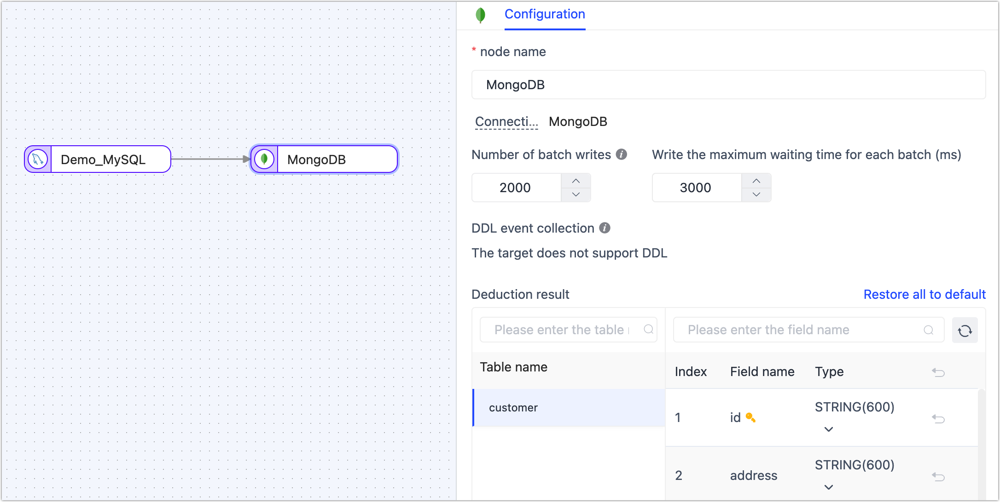

# Create a Data Replication Task

The data replication function can help you to achieve real-time synchronization between the same/heterogeneous data sources, which is suitable for data migration/synchronization, data disaster recovery, reading performance expansion, and other [business scenarios](../../introduction/use-cases.md). 

This article explains the specific data replication process to help you quickly become familiar with creating, monitoring, and managing data replication tasks.

## Prerequisites

Before you create a data replication task, you need to perform the following preparations:

* [Install Tapdata Agent](../../quick-start/install-agent)
* [Connect to a Data Source](../../quick-start/connect-database.md)

## Procedure

As an example of creating a data replication task, the article demonstrates the real-time replication of data from MySQL to MongoDB. However, it's important to note that Tapdata Cloud supports replication tasks between various data sources, so you can configure replication between different combinations of databases based on your specific requirements.

1. Log in to [Tapdata Cloud](https://cloud.tapdata.io/).

2. In the left navigation panel, click **Data Replications**.

3. On the right side of the page, click **Create** to configure the task.

   :::tip

   You can also switch to the Data Console view by clicking the **Board** button. In this view, you simply need to drag the source table to the target database, and a data replication task will be generated automatically. This greatly simplifies the task configuration process and achieves real-time synchronization of source and target data.

   :::

4. On the left side of the page, you can drag and drop the source and destination data icons onto the right canvas. After placing them, you can connect them by drawing a line between them to establish the data flow for the replication task.

   

   :::tip

   In addition to adding data nodes, you can also add processing nodes to complete more complex tasks, such as filtering data, adding or subtracting fields, etc. For more information, see [processing nodes](../data-development/process-node.md).

   :::

5. Click the source node (MySQL in this example) to complete the parameter configuration of the right panel according to the following instructions.

   

   * **Node name**: Defaults to connection name, you can also set a name that has business significance.
   * **DDL event collection**: After enabling the switch, Tapdata Cloud will automatically capture the selected source DDL events, such as the addition of new fields. If the target database supports DDL writing, Tapdata Cloud can synchronize the DDL statements to ensure consistency between the source and target databases.
   * **Select table**: Choose which tables you want to sync.
      * **Select by table name**: Select the table on the left, and then click the right arrow to complete the setup.
      * **Match regular expressions**: Enter the regular expression for the table name. Additionally, when a table is added to the source database and it matches the specified expression, Tapdata Cloud will automatically synchronize the table to the target database.
   * **Batch read number**: The number of records read in each batch during full data synchronization, the default is **100**.

6. Click on the target node, which in this example is MongoDB, to configure the parameters in the right panel based on the following instructions.

   1. Set up the node's basic settings.

      

      * **Node name**: Defaults to connection name, you can also set a name that has business significance.
      * **Number of batch writes**: The number of entries written in each batch during full data synchronization.
      * **Write the maximum waiting time for each batch**: Set the maximum wait time in milliseconds, based on the performance of the target database and the network delay evaluation.
      * **Deduction result**: According to the settings of the source node, Tapdata will write table structure information to the target.

   2. Scroll down to the **Advanced Settings** area to complete the advanced setup.

      

      - **Duplicate processing strategy**: Choose how duplicate data should be handled.
      - **Data write mode**: Keep the default, or select according to business needs.
         - **Process by event type**: Select the data write policy for inserts, updates, and deletes events.
         - **Statistics additional write**: Handles only insert events, discards updates, and deletes events.
      - **Full multi-threaded write**: The number of concurrent threads for writing full data is set to the default value of **8**. You can adjust this value based on the write performance of the target database.
      - **Incremental multi-threaded write**: The number of concurrent threads for writing incremental data is disabled by default. You can adjust this value based on the write performance of the target database.

7. (Optional) Click the  icon above to configure the task properties.

   * **Task name**: Fill in a name that has business significance.
   * **Sync type**: You have the option to select F**ull + incremental synchronization**, or you can choose to perform **Initial sync** and **CDC** (Change Data Capture) separately. In real-time data synchronization scenarios, using the combination of full and incremental data copying allows you to copy existing data from the source database to the target database.
   * **Task description**: Provide a description for the task by filling in the relevant information.
   * **Advanced settings**: Set the start time of the task, select the incremental data processing mode, scheduled tasks, dynamic adjustment memory usage, specify the number of processor threads, and choose the appropriate agent.

8. Click **Start**, and you will be able to view the performance of the task on the current page, including metrics such as QPS (Queries Per Second), delay, and task event statistics.

   

## See also

[Monitor or Manage Tasks](manage-task.md)

