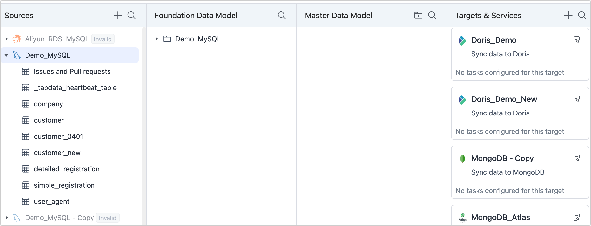

# Automatic Data Flow with One Click

In the Data Service Platform Mode, you can simply drag the source table to the required level to generate a data pipeline and automatically start the task, greatly simplifying the task configuration process. This article describes how to achieve the flow of data between different levels and finally provide it to the terminal business.

## Procedure

1. Log in to [Tapdata Cloud](https://cloud.tapdata.io/).

2. In the left navigation panel, click **Data Console**.

3. On this page, you can conveniently access the data source information you have entered. Tapdata organizes the data governance and flow order into four distinct levels, providing a clear view of the data hierarchy.

   

   :::tip

   For detailed descriptions of each level, see [Data Service Platform Introduction](enable-daas-mode.md).

   :::

4. Follow the process below to complete the data flow with one click.

   :::tip
   Through the Data Processing Layer, you can adjust the table structure (such as adding fields), merge tables, build wide tables, etc. If the table of the cache layer already meets your business needs, you can directly publish the API or drag the table of the cache layer to the **Target Data and Service Layer**.
   :::

import Tabs from '@theme/Tabs';
import TabItem from '@theme/TabItem';

<Tabs className="unique-tabs">
    <TabItem value="cache" label="Flow to Data Cache Layer" default>
    <ol>
    <li>At the <b>Source Data Layer</b>, click the </img> icon to find the table you want to synchronize and drag it to the <b>Data Cache Layer</b>. </li>
    

    <li>In the pop-up dialog, fill in the table prefix and click <b>OK</b>. In this case, the table we want to synchronize is the <b>demo_table</b>, fill in the prefix here is <b>FDM_Demo</b>, then in the Data Cache Layer, the table is called <b>FDM_Demo_demo_table</b>. </li>
    </img>
    
After completing the operation, Tapdata Cloud will automatically create a data replication task to synchronize your selected tables in real-time to the Data Cache Layer and automatically verify. You can click the </img> icon on the right side of the table name in the Data Cache Layer and jump to the task monitoring page to see the task operation details. 

    </ol>
   </TabItem>
   <TabItem value="curated" label="Flow to Data Processing Layer">
    <ol>
    <li>At the <b>Data Cache Layer</b>, click the </img> icon to find the table you want to process and drag it to the <b>Data Processing Layer</b>. </li>
    

    <li>In the pop-up dialog, fill in the table name and select whether to start the task.
    

    <ul>
    <li><b>Only Save</b>: Save the task without running it. You can now click on the task name in the target data card to customize the task further. On the redirected task configuration page, you can <a href="../../data-development/process-node">processing nodes</a> to meet requirements such as table structure adjustment (e.g., adding fields), table merging, and building wide tables. Once the setup is complete, click <b>Start</b> in the upper right corner of the page. </li>
    <li><b>Save and Run</b>: No further action is necessary as Tapdata Cloud automatically generates a data development task and initiates it to synchronize the table in real-time with the Data Processing Layer. </li>
    </ul></li>
    

    <li>At the <b>Data Processing Layer</b>, find the target table and click the </img> icon on the right to view the tasks associated with the table and the basic information of the table, including column information, sample data, schema and other information. </li>
    </img>
    </ol>
   </TabItem>
   <TabItem value="target" label="Flow to Target&Service Layer">
    <ol>
    <li>From either the <b>Data Cache Layer</b> or the <b>Data Cache Layer</b>, locate the desired table that you wish to synchronize. Then, simply drag and drop the table onto the target data source within the Target Data and Service Layer.</li>
    </img>
    

    <li>IIn the pop-up dialog, enter the task name and choose whether to run the task.
    

    <ul>
    <li><b>Only Save</b>: Save the task without running it. You can now click on the task name in the target data card to customize the task further. On the redirected task configuration page, you can add <a href="../../data-development/process-node">processing nodes</a> to meet requirements such as table structure adjustment (e.g., adding fields), table merging, and building wide tables. Once the setup is complete, click the <b>Start</b> in the upper right corner of the page.</li>
    <li><b>Save and Run</b>: No further action is necessary as Tapdata Cloud automatically generates a data development task and initiates it to synchronize the table in real-time with the Data Processing Layer. </li>
    </ul>
    </li>
    

    
Once setup is complete, Tapdata will automatically create a data development task to synchronize your source tables in real-time to the selected target data source and provide them to the final business. You can also click the task name in the target data card to enter the task monitoring page to see the detailed operation status. For more information, see <a href="../../data-development/monitor-task">Monitor Task</a>. 

    </ol>
   </TabItem>
  </Tabs>