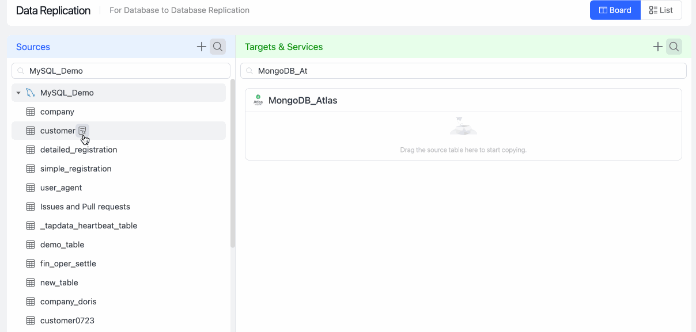

# Generate Data Pipeline with One Click

In the Data Integration Mode, you can simply drag the source table to the target database to generate a data pipeline with one click, greatly simplifying the task configuration process and real-time synchronization of source data. This article introduce how to generate a data pipeline.

## Procedure

1. Log in to [Tapdata Cloud](https://cloud.tapdata.io/).

2. In the left navigation panel, click **Data Console**.

3. You can easily view your entered data source information on this page, divided by Tapdata Cloud into two columns labeled "Source Data" and "Target Data".

   

4. (Optional) Click the 🔍 icon to find the source table you want to synchronize and drag it to the right target data source.

5. In the pop-up dialog, fill in the name of the task that has business significance and select whether to run the task.

   

   - **Only Save**: Only save the task. At this time, you can click the task name in the target data card to customize the task, such as adding a [processing node](http://localhost:3000/cloud/user-guide/data-development/process-node) on the redirected task configuration page, realizing the requirements of table structure adjustment (such as adding fields), merging tables, building wide tables, etc. After completing the setup, click **Start** in the upper right corner of the page.

   - **Save and Run**: No additional action is required, and Tapdata Cloud automatically creates a data development task and runs it to synchronize your source tables in real-time to the selected target data source. In this case, Tapdata Cloud will synchronize the **customer** table in the source MySQL to MongoDB in real-time.

      You can also click the task name in the target data card to enter the task monitoring page to see the detailed operation status. For more information, see [Monitoring Tasks](../../data-development/monitor-task.md).

