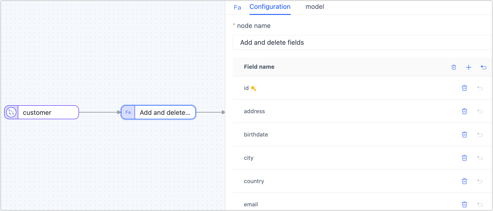
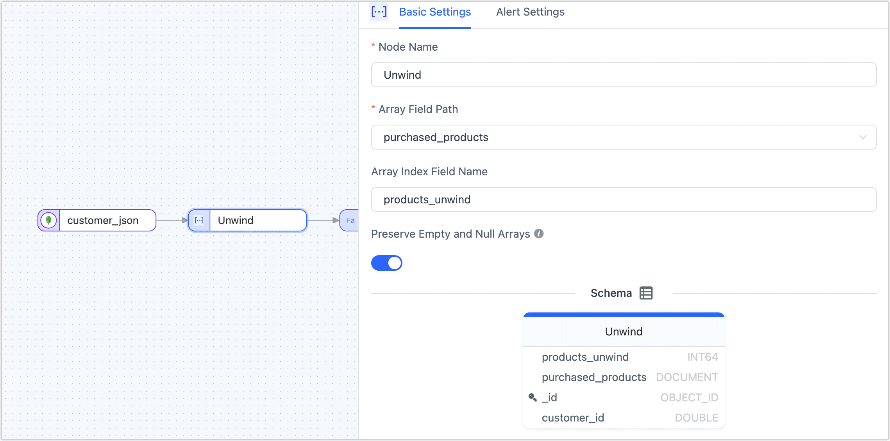

# Add Processing Node

Tapdata Cloud supports the addition of processing nodes to data replication or pipeline tasks, providing the flexibility to incorporate data filtering, field adjustments, and other processing operations as needed. This allows users to customize and enhance their data replication workflows based on specific requirements.

## Row Filter

The main usage of processing nodes in Tapdata Cloud is to filter table data, where users can set filtering conditions and execution actions.

* **Execute action**: Users have the option to either retain or discard the matching data when using processing nodes in Tapdata Cloud.

* **Conditional expression**: An expression that sets a filter condition
* **Example expression**: Filter out individuals who are either men over 50 years old or people under 30 years old with incomes of 10,000 or less. The filtering condition can be expressed as `( record.gender == 0&& record.age > 50) || ( record.age >= 30&& record.salary <= 10000)`.


## Add and Delete Fields

The **Add and Delete Fields** node can be added to the canvas and its parameters can be configured after connecting it to the data node. It allows for adding new fields or deleting existing fields, and if a field is deleted, it will not be passed to the next node, and you can also adjust the fields order.




## Field Rename

To rename or convert the case of a field, add the **Field Rename** node to the canvas, connect it to the data node in the desired processing order, and configure the node parameters accordingly.


## Field Calculation

To assign a value to a field by performing calculations between fields, add the **Field Calculation** node to the canvas. Connect the node to the data node in the desired processing order and configure the calculation rules for the target field using  JavaScript (JS) expressions.


## Type modification

The Type modification node can be used to adjust the data type of the field.


## <span id="pri-sec-merged">Master Slave Merge</span>

In big data processing and analysis, merging and transforming data is a pivotal task. In this case study, using the `lineorder` and `date` tables from the [SSB Dataset](https://www.cs.umb.edu/~poneil/StarSchemaB.PDF) as examples, we'll demonstrate how to use Tapdata Cloud to fulfill the need to merge multiple tables into one MongoDB collection.

:::tip

When using the Master Slave Merge, it's essential to [upgrade the Agent instance](../manage-agent.md) to version 3.5.1. Additionally, the target database should be either a self-deployed MongoDB or MongoDB Atlas.

:::

**Procedure**:

1. Log in to [Tapdata Cloud](https://cloud.tapdata.io/).

2. On the left navigation bar, click **Data Transformation**.

3. Click **Create** on the right side of the page.

4. Drag and drop the data sources you want to merge from the left side of the page to the right canvas. Then, drag the **Master Slave Merge** node from the bottom-left corner and connect them in the sequence shown below.

   

5. Click on each of the data sources you want to merge sequentially and select the tables to be merged (**lineorder** / **date**) from the panel on the right.

6. Click the **Master Slave Merge** node, drag and drop the `date` table into the `lineorder` table to signify their relationship. Subsequently, you can view the merged table structure.

   

7. Drag a MongoDB or MongoDB Atlas data source from the left side of the page to store the merged table and then connect the **Master Slave Merge** node to this data source.

8. Click the data source you intend to store the merged table in, then select a target table or input a table name for Tapdata Cloud to automatically create in the right panel. After setting up, choose to update conditions.

   

9. After confirming the configurations are correct, click **Start**.

   Once the process is completed, you can monitor the task's performance on the current page, such as QPS, latency, task time statistics, etc.

## <span id="union-node">Union</span>

The **Union** node in Tapdata Cloud merges multiple tables with the same or similar structure into a single table, combining the data based on matching field names. The detail rules are as follows:

- When the type length and precision of the deduction are different, you need to select the maximum length precision.
- If the column type of the deduction is different, it can be converted to a generic type.
- In scenarios where the primary key fields of all source tables are consistent, the primary key will be retained in the target table. However, if the primary key fields differ among the source tables, the primary key will be removed in the target table.
- Similarly, if the same fields of all source tables have non-empty restrictions, these non-empty restrictions will be retained in the target table. Conversely, if the non-empty restrictions differ among the source tables, the non-empty restrictions will be removed in the target table.
- The unique index of the source table will not be replicated or synchronized to the target table.


**Example Scenario:**

Assume that we want to merge(Union) **student1** and **student2** tables with the same table structure into one table, and then store the result in the **student_merge** table. The tables structure and data are as follows:


**Operation**:

1. Log in to [Tapdata Cloud](https://cloud.tapdata.io/).

2. In the left navigation bar, click **Data Pipelines**.

3. On the right side of the page, click **Create** to configure the task.

4. Drag the desired data source from the left side of the page and place it onto the right canvas. Then, locate the **Union** node at the bottom left corner of the page and drag it onto the canvas. Finally, connect the data source node to the Union node to perform the append merge operation.

   

5. Click on the desired data source that you want to perform the append merge with. In the panel on the right side of the page, select the table that you wish to merge, either **student1** or **student2**.

6. Click on the **Union** node and navigate to the **Model** tab to view the table structure information after the append merge.

7. From the left side of the page, drag a data source to store the merged table, and then connect the **Union** node to the data source.

8. Click the data source where the appended merged table is stored, and in the panel on the right side of the page, select the target table (**student_merge**) and advanced settings.

   :::tip

   If you want Tapdata Cloud to automatically create a table structure, you can create an empty table named **student_merge** in the target database in advance (the table structure is unlimited). Then, in the **advanced settings**, select **Existing data processing** as **Clear the original table structure and data on the target side**.

   :::

   

9. After confirming that the configuration is correct, simply click on the **Start** to initiate the task. 

   After the operation is completed, you can observe the performance of the task on the current page. This includes metrics such as QPS (Queries Per Second), delay, task time statistics, and more.

   


**Result verification**

Query the **student_merge** table, and the result is as follows:

```sql
mysql> select * from student_merge;
+---------+------+--------+------+-------+--------+
| stu_id  | name | gender | age  | class | scores |
+---------+------+--------+------+-------+--------+
| 2201101 | Lily | F      |   18 |  NULL |   NULL |
| 2201102 | Lucy | F      |   18 |  NULL |   NULL |
| 2201103 | Tom  | M      |   18 |  NULL |   NULL |
| 2202101 | Lily | F      |   18 |     2 |    632 |
| 2202102 | Lucy | F      |   18 |     2 |    636 |
| 2202103 | Tom  | M      |   18 |     2 |    532 |
+---------+------+--------+------+-------+--------+
6 rows in set (0.00 sec)
```


## <span id="python">Python</span>

If the built-in processing nodes don't fully meet your specific needs, or if you want to process data in a more detailed and personalized manner, you can add a Python processing node. By writing custom python scripts, you can manage the processing/logic of data. The processed data will then be synchronized to the target database, allowing you to customize the data link freely and better control the flow and processing of data.


The Python processing node supports version Python 2.7.3. The supported third-party packages include: **requests-2.2.1**, **PyYAML-3.13**, and **setuptools-44.0.0**. The content description for `context` in the above image is as follows:

```python
context = {
        "event": {},  # Event type, table name, and other information from the data source
        "before": {}, # Content before data changes
        "info": {},   # Event information from the data source
        "global": {}  # Container for state storage at the node level within the task cycle
      }
```

System packages supported by the Python processing node include: `struct, jarray, _marshal, _bytecodetools, binascii, ucnhash, _sre, sys, cmath, itertools, jffi, operator, _py_compile, array, zipimport, _codecs, _hashlib, bz2, gc, posix, cPickle, synchronize, _random, _imp, errno, __builtin__, _csv, _json, _weakref, thread, exceptions, _ast, cStringIO, _jyio, _collections, _functools, _threading, _jythonlib, math, time, _locale`.

Below are references on how to use common libraries:

```python
# For using the yaml package, refer to: https://pyyaml.org/wiki/PyYAMLDocumentation
data = {'key1': 'value1', 'key2': 'value2'}
yaml_str = yaml.dump(data, default_flow_style=False)
log.info('(1)Use YAML may convert data to YAML string: \n{}', yaml_str)

# Modify a specific field in the data
record['prefix'] = 'ust-modified'

# Properly log messages
log.info("(3)log an info") # Print info-level logs
log.warn("(4)log a warning") # Print warning-level logs

# For using requests, refer to: https://requests.readthedocs.io/projects/cn/zh_CN/latest/
try: 
  response = requests.get("http://localhost:3000")
  log.info('Request result: {}', response.text)
except Exception as e:
  log.info('Request result: {}', str(e))

# For using the json module, refer to: https://docs.python.org/zh-cn/2.7/library/json.html
log.info("Json value: {}", json.dumps(['Gavin', {'key': ('value', None, 1.0, 2)}]))

# For using random, time, datetime, uuid
log.info("(7)Time value: {}",time.time()) 
log.info("(7-1)Datetime value: {}", datetime.datetime(2023, 9, 19, 11, 8, 0)) 

# For using the math module, refer to: https://docs.python.org/zh-cn/2.7/library/math.html
log.info("(9)Math value: {}", math.sqrt(100)) 

# For using the hashlib module, refer to: https://docs.python.org/zh-cn/2.7/library/hashlib.html
m = hashlib.md5()  # Create an MD5 object
m.update("xjh999".encode(encoding='utf-8')) # Specify encoding format and add the string to the MD5 object
password_md5 = m.hexdigest()  # hexdigest() produces a hexadecimal string representation
log.info("(10)hashlib value: {}", password_md5) 

# For using the base64 package, refer to: https://docs.python.org/zh-cn/2.7/library/base64.html
try:
  tmpBytes = "xjh999999999".encode()
  tmpBase64 = base64.b64encode(tmpBytes)
  log.info("(11)base64 value: {}", tmpBase64)
except Exception as e:
  log.info('(11)base64 failed：{}',e)

# For using the types package, refer to: https://docs.python.org/zh-cn/2.7/library/types.html
log.info("(12)Types value: {}", type(100))
return record
```


## <span id="Unwind">Unwind</span>

**Unwind** is specifically designed to handle array contents in JSON data structures, efficiently "unwinding" each element in an array and converting them into independent data rows. This approach is particularly suitable for scenarios that require deep analysis of array data, such as data normalization, personalized report generation, data transformation, and data quality cleaning. Additionally, when the target system or application does not support array formats, or for compatibility with other data structures, the Unwind node provides a ready-to-use solution, ensuring the efficiency and accuracy of the data processing and synchronization process.

Suppose there is a collection named `customer_json` that records the list of products purchased by each customer. To analyze the sales of each product in more detail, we want to convert the product list from an array format to separate data rows. In this way, each product will have a corresponding customer purchase record. To achieve this requirement, we can add an **Unwind** node when configuring the data transformation task. The node configuration example is as follows.



:::tip

* If it is a transformation task between MongoDB databases, you also need to add an **Add and Delete Fields** node to remove the **_id** to avoid errors due to repeated data writing.
* If it is a relational database (such as MySQL) as target, you need to add a primary key that can distinguish logic in the target table.

:::


## <span id="js-process">JS Processing</span>

Support is provided for data processing through JavaScript or Java code. When writing the code, it is important to ensure  source node and the target node is connected. This ensures seamless data processing between the two nodes.


### Model Declarations

For JS nodes, Tapdata Cloud deduces the model information of the node by sampling data trial run. If the deduced model is found to be inaccurate or the number of fields changes, the field information in the model can be defined explicitly by the model declaration.


In the development task, the method that the model declares support is as follows:

```javascript
// Add a field when the field does not exists
TapModelDeclare.addField(tapTable, 'fieldName', 'TapString')
// Remove an existing field
TapModelDeclare.removeField(tapTable, 'fieldName')
// Update an existing field
TapModelDeclare.updateField(tapTable, 'fieldName', 'TapString')
// Update a field, and add it if it doesn't exist
TapModelDeclare.upsertField(tapTable, 'fieldName', 'TapString')
// Setting a field as primary key
TapModelDeclare.setPk(tapTable, 'fieldName')
// Undo setting primary key
TapModelDeclare.unsetPk(tapTable, 'fieldName')
// Add an index
TapModelDeclare.addIndex(tapTable, 'indexName', [{'filedName':'fieldName1', 'order': 'asc'}])
// Remove an index
TapModelDeclare.removeIndex(tapTable, 'indexName')
```

Parameter Description

- `tapTable`: Fixed parameter, return value of JS node
- `fieldName`: The name of the field to be added or manipulated
- `indexName`: The name of the index to be added or manipulated
- `TapType`: The type of field to be added or the type of the existing field to be modified to the target type. Currently only supports the built-in `TapType`, support:
   - `TapBoolean`: Boolean type, use boolean to store boolean values
   - `TapDate`: Date type, use custom DateTime to store date values
   - `TapArray`: Array type, use Array to store Array values
   - `TapNumber`: Numeric type, use Java's Double to store numeric values
   - `TapBinary`: Binary type, use byte to[] store byte arrays
   - `TapTime`: Time type, use DateTime to store time values
   - `TapMap`: Map type, use Map to store Map values
   - `TapString`: String type, use Java's String to store strings
   - `TapDateTime`: Datetime type, use custom DateTime to store date and time values
   - `TapYear`: Year, use DateTime to store time values


### Use cases

1. Processing data records in a JS node
2. Calling a custom function in a JS node to process data
3. Caching calls in a JS node
4. Other scenarios that require custom processing logic using JS nodes

### JS Built-in Function Description

* [Standard JS](../../appendix/standard-js.md): Tapdata Cloud supports processing and operating on data records, providing various functions and operations to manipulate and transform data. For example, you can use JavaScript or Java code to convert date strings to Date types. This allows you to perform date-related operations, comparisons, and formatting on the data records as needed. With this capability, you have flexibility in manipulating and transforming your data to meet your specific requirements.
* [Enhanced JS (Beta)](../../appendix/enhanced-js.md): Tapdata Cloud supports making external calls in JavaScript code using standard built-in functions. This allows you to perform network requests, interact with databases, and perform other operations by utilizing the capabilities of JavaScript and its built-in functions.

