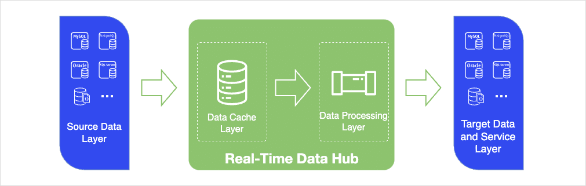
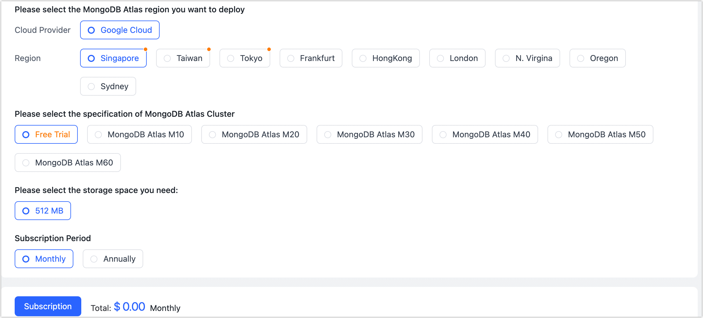

# Enable Real-Time Data Hub

Due to digital transformation, the presence of isolated data, data fragmentation, or data silos has emerged as a significant challenge. Moreover, there is a growing demand for data in business operations. However, traditional data delivery methods pose limitations, such as lengthy processes and substantial resource requirements. This situation calls for a solution that enables organizations to swiftly establish data flow pipelines and unlock the value of their data.

Tapdata Cloud's Real-Time Data Hub offers a powerful solution. By synchronizing data from diverse business systems to a unified platform cache layer, it enables the consolidation of data sources and facilitates seamless data processing and analysis. This unified and real-time data platform helps enterprises overcome data silos and promotes data-driven decision-making, ultimately enhancing their competitiveness in the market.

## Real-Time Data Hub Introduction

With the increase in the tasks carried by the source database, in order to minimize the impact of data extraction on the source database and adhere to the organization's concept of data hierarchical governance, Tapdata Cloud organizes the data service platform in a layered manner based on the data flow order. This hierarchical arrangement ensures efficient and structured data processing, allowing for better data management and seamless integration across different systems.

| Hierarchy | Description                                                                                                                                                                                                                                                                                                                                                                                                                                                                              |
| -------------------- |------------------------------------------------------------------------------------------------------------------------------------------------------------------------------------------------------------------------------------------------------------------------------------------------------------------------------------------------------------------------------------------------------------------------------------------------------------------------------------------|
| **Source Data Layer** | Tapdata Cloud consolidates data sources from various business systems into a centralized data source layer, which serves as the initial step in bridging data silos. This abstraction of data sources enables a unified and streamlined approach to accessing and utilizing data. For more detailed instructions, please refer to the [Connect Data Sources](../../prerequisites/README.md) section for comprehensive information on establishing connections with your data sources. |
| **Data Cache Layer** | By synchronizing the table from the source database to the Data Cache Layer beforehand, the data can be readily accessed by the business through the Foundation Data Layer, thus eliminating the need to directly read or manipulate the data in the source database, such as performing union operations, during data processing. This approach significantly minimizes the impact on the business operations of the source database.                                                   |
| **Data Processing Layer** | If there is a need for extensive customization of data processing or operations, such as generating a wide table, it is possible to extract the data table from the Data Cache Layer and perform the required operations within the Data Processing Layer. This allows for the generation of model data that can be used in the final business processes.                                                                                                                                |
| **Data Targets and Service Layer** | Tapdata Cloud provides a centralized platform that aggregates and presents various data sources, allowing them to be utilized as targets for data processing. This enables the provision of processed data to the business, facilitating the creation of a unified data service platform for enterprises.                                                                                                                                                                                |

## Procedure

In the Real-Time Data Hub, we need to prepare a MongoDB database as a data repository for the Data Cache Layer and Data Processing Layer.

1. Log in to [Tapdata Cloud](https://cloud.tapdata.io/).

2. In the left navigation panel, click **Real-Time Data Hub**.

3. Review the introduction of the Real-Time Data Hub and scroll down to the bottom of the page, Click on **Configure Storage**.

4. Choose the provider for MongoDB Atlas services, deployment region, specification, and subscription period as follows:
   

   * **Cloud Provider**: Currently supported: Google Cloud.
   * **Region**: Select the deployment region. Choose a region close to your data source for minimal network latency.
   * **Specification**: Pick the **specification** and **storage size** for MongoDB Atlas.
     :::tip
     Tapdata Cloud offers a free trial option with specifications that you can select. You can choose the **Free Trial** option to get started.
     :::
     

Specifications Description

     <ul>
     <li>M10: 2 vCPUs, 2 GB RAM</li>
     <li>M20: 2 vCPUs, 4 GB RAM</li>
     <li>M30: 2 vCPUs, 8 GB RAM</li>
     <li>M40: 4 vCPUs, 16 GB RAM</li>
     <li>M50: 8 vCPUs, 32 GB RAM</li>
     <li>M60: 16 vCPUs, 64 GB RAM</li>
     </ul>
     

   * **Subscription Period**: Select the desired subscription period.
   

Want to use an existing MongoDB Atlas?

     At the top of the page, click on <b>click here to privede the connection information</b>, and fill in the MongoDB Atlas connection URL.
   

5. Click **Subscription**, on the following page, carefully review and confirm the specifications you wish to purchase. Ensure that the selected billing method aligns with your preferences. Additionally, verify that the email address provided is accurate and where you would like to receive the bill. 

6. Once you have double-checked all the information, click on the **Pay Now** button to proceed with the purchase.

7. You will redirected to payment page. Please follow the instructions on the payment page to complete the payment process. 

   After the payment is completed, the page will return to the **Real-Time Data Hub** page. Once the instance is automatically deployed, the page will be organized and displayed according to the [hierarchy we introduced before](#intro). For information on how to use it, see [Real-Time Data Hub Dashboard Introduction](dashboard.md).

   
