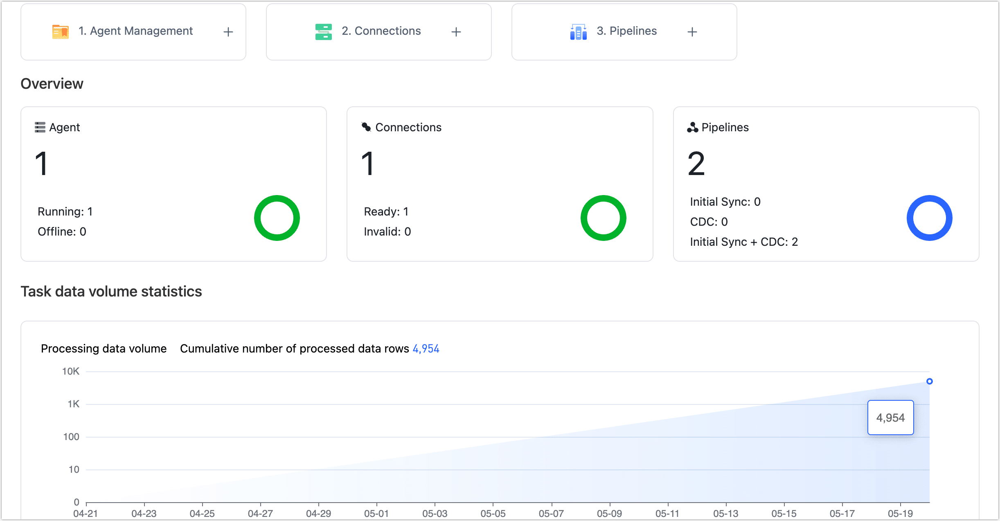

# Dashboard

The dashboard provides a convenient platform to swiftly understand the product's functionality and effortlessly perform tasks like creating agents, establishing connections, and setting up tasks.

## Quick Start

To experience the powerful data transfer capabilities of Tapdata Cloud, follow these three simple steps:

| Page Button | Description | Related Doc |
| ------------- | ------------------------------------------------------------ | ---------------------------------------------------- |
| ① Agent | Deploy the Agent by following the prompts on the Agent deployment page.  | [Install Agent](../quick-start/install-agent/README.md) |
| ② Connections | Establish a connection between the Agent and the database according to the page prompts.  | [Connect Database](../quick-start/connect-database.md) |
| ③ Pipelines | Create a task that can synchronize data from various data sources to the target database and perform data processing during the synchronization process, such as ETL. | [Create a Data Pipeline](../quick-start/create-task.md) |

## Overview

You can view the information related to Agents, Connections, Number of Pipelines, and their respective statuses.

## Task Data Volume Statistics

Provides a summary of the daily task data, including the total number of inserted, updated, deleted, and DDLs (Data Definition Language) operations.

## System Notification

To conveniently access the most recent system notifications and alerts, including Agent status updates, simply hover your mouse over the **Notification** icon located in the upper right corner. Moreover, by clicking on **View all notifications**, you can navigate to the **System notification** page and configure the settings for Agent notifications, such as Mail/SMS notifications, and more.
