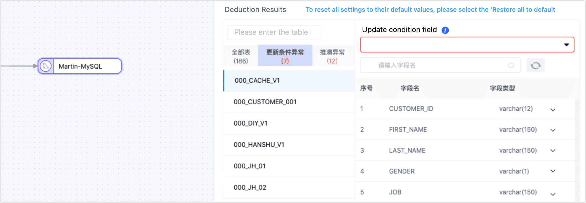

# Product Features/Usage

import Content from '../reuse-content/_all-features.md';

<Content />

This article lists common questions encountered while using Tapdata.

## What data sources does Tapdata support?

Tapdata supports a wide range of databases, including common relational, non-relational, and queue-based data sources. For details, see [Supported Databases](../introduction/supported-databases.md).

## Does Tapdata offer a trial?

Yes. You can click on “[Apply for a Trial](https://tapdata.net/tapdata-on-prem/demo.html),” and a Tapdata engineer will contact you to assist with the trial.

## How does Tapdata charge?

Tapdata offers two deployment options, **Cloud** and **Enterprise**, to meet your diverse needs:

| Product            | Applicable Scenarios                                                | Pricing Information                                                                                                    |
| ------------------ | ------------------------------------------------------------------- | ---------------------------------------------------------------------------------------------------------------------- |
| Tapdata Cloud      | Register an account on [Tapdata Cloud](https://cloud.tapdata.net/console/v3/) to use, suitable for scenarios requiring quick deployment and low initial investment. Helps you focus more on business development rather than infrastructure management. | Provides one SMALL specification Agent instance for free (semi-managed mode). You can also subscribe to higher specifications or more Agent instances based on business needs. See more at [Product Billing](billing/billing-overview.md). |
| Tapdata Enterprise | Supports deployment to local data centers, suitable for scenarios requiring sensitive data handling or strict network isolation, such as financial institutions, government departments, or large enterprises wanting full control over their data. | Based on the number of server nodes deployed, pay the corresponding subscription fees annually. Before making a purchase, you can click “[Apply for a Trial](https://tapdata.net/tapdata-on-prem/demo.html)” and a Tapdata engineer will assist you with the trial. See more at [Product Pricing](https://tapdata.net/pricing.html). |

## What to do if the connection test fails?

When creating a data connection, refer to the connection configuration help on the right side of the page and complete the settings according to the guide. You can also refer to [Preparation Work](../prerequisites) to complete the setup.

## When configuring a replication task, why is the target node inference result abnormal?

Tapdata automatically infers the target table structure and other information based on the selected source table. Here are some common issues you might encounter:

* **Update Condition Anomalies**: Tapdata automatically sets the update condition to the table's primary key. If there is no primary key, it uses a unique index field. If there is no primary key or unique index, you will need to manually specify the field for the update condition.
* **Inference Anomalies**: Usually caused by abnormal field types, you can adjust the types of the relevant fields as suggested on the page.

## What is Tapdata's logic for handling transactions?

Usually, a transaction includes starts, processes, commits, and rollbacks. Therefore, after a transaction starts, multiple SQLs might be initiated, and Tapdata captures these changes and stores them temporarily.

Transactions that remain uncommitted for a long time will cause the task to mine from this transaction's start upon each stop and start, affecting the source database and incremental sync performance. To avoid this, Tapdata cleans up uncommitted transactions that exceed a certain duration. If the source database commits such a transaction after it has been cleaned, it might lead to data inconsistencies.

To avoid such issues, set the lifespan of uncommitted transactions in the source node (such as Oracle databases) during task configuration to meet business needs.

## Does Tapdata support publishing tables as API services?

import Content1 from '../reuse-content/_enterprise-features.md';

<Content1 />

Yes (for single tables), you can publish processed tables [as API services](../user-guide/data-service/create-api-service.md) to allow other applications to easily access and retrieve data.

## How to publish complex multi-table queries as API services?

import Content2 from '../reuse-content/_enterprise-features.md';

<Content2 />

For complex multi-table query scenarios, common solutions include materialized views and ad-hoc queries:

* **Materialized Views**: A materialized view is a pre-calculated and stored virtual table that provides high-performance data access when queried. By pre-executing multi-table join operations and storing the results as a materialized view, you can significantly improve query performance and response times. This approach is suitable for scenarios where data change frequency is low because the materialized view needs to be updated with each data change.
* **Ad-hoc Queries**: Ad-hoc queries are executed on demand without any pre-calculation and storage process. This approach is suitable for scenarios with high data change frequency because it can retrieve the latest data in real-time, though it may lead to higher query costs and longer response times during multi-table join operations.

In Tapdata, you can solidify complex multi-table queries into a materialized view and provide API services based on that view. You can choose the following strategies based on the complexity of the query and real-time data requirements:

**Real-Time View Strategy**

Suitable for scenarios where SQL statements are relatively simple and there is a high requirement for data timeliness. The core idea is to use various [process nodes](../user-guide/data-pipeline/data-development/process-node) to implement specific operations in SQL statements (such as joins), ultimately synchronizing the processed data to a new table in real-time and then creating and publishing an API service based on that table.

Steps include:

1. [Create a data transformation task](../user-guide/data-pipeline/data-development/create-task).
2. Replace specific operations in the SQL statement with process nodes. For example, as shown in the image below, we pre-join **customer** and **company** tables (implemented through a [join node](../user-guide/data-pipeline/data-development/process-node#join)) and store the results in the **join_result** table.
   
3. Start the task to implement real-time data synchronization.
4. Based on the new table (join_result), [create and publish an API service](../user-guide/data-service/create-api-service.md).

**Batch View Strategy**

For extremely complex SQL statements (e.g., SQL nesting, complex joins), you can directly execute the SQL statement during the full sync phase, sync the results to a new table, and then create and publish an API service based on that table. This strategy is suitable for scenarios where SQL complexity is high, but the demand for real-time data is not.

Steps include:

1. [Create a data transformation task](../user-guide/data-pipeline/data-development/create-task).
2. Add source and target nodes on the canvas.
   :::tip
   The target node should be a weak Schema class data source, such as MongoDB or Kafka.
   :::
3. In the source node settings, turn on the custom query switch for full sync and add the SQL query statement needed during the full data sync phase (does not affect the incremental phase).
   
4. After setting up the target node, click the settings in the upper right corner of the page, set the synchronization type to **full**, and then set a regular scheduling strategy based on real-time requirements.
5. Start the task and wait for it to run to completion before creating and publishing an API service based on the new table [create and publish an API service](../user-guide/data-service/create-api-service.md).