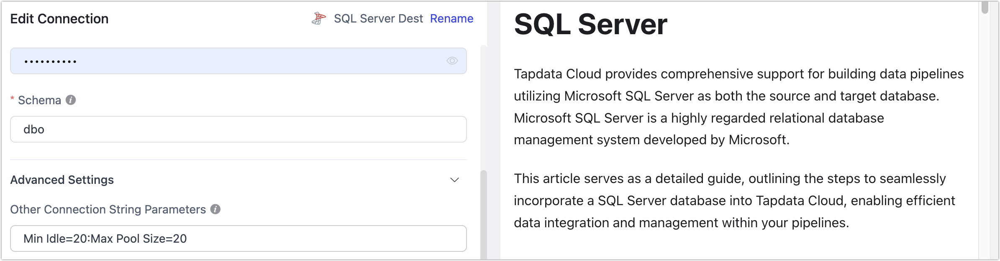

# Task Log Error and Troubleshooting Guide

import Content from '../reuse-content/_all-features.md';

<Content />

This document aims to provide you with a detailed guide for identifying and resolving common errors found in the logs of data synchronization tasks. We delve into the causes of various common errors and offer clear, practical troubleshooting steps to help users quickly locate and solve issues.

## Viewing Task Logs

Task runtime logs can be viewed at the bottom of the [task monitoring page](../user-guide/data-pipeline/copy-data/monitor-task#error-code). For common issues, Tapdata has solidified them into specific [error codes](error-code.md) for your convenience, along with their causes and solutions. If the relevant error code is not found, you can also troubleshoot based on the log keywords provided in this document or contact technical support.

## Oracle

### ORA-01555, snapshot too old

**Scenario**: This error often occurs in databases with frequent changes during full data synchronization, preventing the completion of full data synchronization.

**Solution**: Adjust the Oracle's undo size. If adjustment is not possible temporarily, reduce the number of concurrent synchronization tasks on this database and retry.

### ORA-01325, archive log mode must be enabled to build into the logstream

**Scenario**: This error occurs when Oracle is used as the source and incremental data synchronization fails.

**Solution**: Enable Oracle's archive logging. For details, see [Preparation for Oracle Data Source](../prerequisites/on-prem-databases/oracle.md).

### ORA-00257

**Scenario**: Oracle is used as the source, but archive log archiving time is not configured, requiring manual cleanup of archives. If the log space is full, the database will not be able to continue providing services.

**Solution**: Steps include:

1. In sqlplus, first check the storage configuration of the archive log with `show parameter recover;`. If using the default flashback, you can see the configured size from **db_recovery_file_dest_size**'s **size**.

2. Use the following command to view the disk size occupied by archived_log each day over a period.

   ```sql
   select trunc(COMPLETION_TIME) as "Date",
        count(*) as count,
        (sum(blocks*block_size))/1024/1024/1024 size_g
   from v$archived_log
   group by trunc(COMPLETION_TIME)
   order by 1;
   ```

3. Adjust the size of db_recovery_file_dest_size according to the expected storage time of archived_log.

   For example, adjust with the command: `alter system set db_recovery_file_dest_size=100g;`

   In addition, it is recommended to regularly clean up expired archive logs with a script.

### ORA-06550, PLS-00201, ORA-00942

**Scenario**: Oracle is used as the source and fails to perform full or incremental synchronization.

**Solution**: Typically, this is a permission assignment issue. For authorization methods, see [Preparation for Oracle Data Source](../prerequisites/on-prem-databases/oracle.md).

### ORA-01400: cannot insert NULL into...

**Scenario**: Oracle is used as the target, and the task log indicates the above error.

**Solution**: Check if there are null values in the primary keys of the source table. If present, adjust the source table data or add a row filter node to exclude null primary keys.

## MongoDB

### Failed to resume change stream, Resume of change stream was not possible, as the resume point may no longer be in the oplog

**Scenario**: When MongoDB is used as the source, the task pauses for too long or the target writes relatively slowly, causing the breakpoint to be overwritten and incremental data synchronization cannot continue.

**Solution**: Use `rs.printReplicationInfo()` to check the oplog window period. It's recommended to keep the window at least 3 days to cope with some emergencies, then restart the task.

## MySQL

### Failed to authenticate to the MySQL database ...

**Scenario**: MySQL 8.0 is used as the source. Connection tests are normal, but the task fails during the incremental data synchronization stage.

**Solution**: Log in to the MySQL database, execute the command `select host,user,plugin,authentication_string from mysql.user;` to check the encryption method of the corresponding user. If the current encryption method is `caching_sah2_password`, execute the following format of command to change it to `mysql_native_password`, then restart the related tasks.

```sql
-- Replace your username, password, and host information
ALTER USER 'username'@'localhost' IDENTIFIED WITH mysql_native_password BY 'password';
```

### Row size too large

**Scenario**: The maximum length for the VARCHAR type in MySQL is 65,535 bytes, but MySQL supports a maximum of 65,535 bytes per row record. When multiple fields together exceed 65,535 bytes, this error occurs.

**Solution**: Adjust the task configuration. In the target node settings, change the VARCHAR type to TEXT type or BLOB type, then try restarting the task to fix the issue.

## Redis

### Could not get a resource from pool

**Scenario**: This error occurs when conducting a connection test to Redis, especially when the Redis database is under very high load, such as high CPU or memory usage.

**Solution**: Try to increase the resource allocation for the Redis database and then re-execute the connection test.

## SQL Server

### HikariPool-1082 - Connection is not available, request timed out after 30000ms

**Scenario**: SQL Server is used as the target, and multi-threaded writing is enabled, causing the task to fail immediately after starting. This scenario, due to enabling multi-threaded writing, leads to too many connections, excessive thread request load, and this error.

**Solution**: Choose and execute any of the following solutions, complete the operation, and then reset and restart the task.

- Try to turn off multi-threaded writing in the task's target node.

  

- In the connection management page, find the SQL Server connection, set the connection parameter value larger (e.g., `Min Idle=20;Max Pool Size=20`) through connection string parameters, as shown below:

  

### Cannot insert NULL into...

**Scenario**: SQL Server is used as the target, manual adjustments were made to the non-null constraints of the target table, causing this error.

**Solution**: Revert the non-null constraints of the target table and then restart the task.

:::tip

Do not manually adjust the structure of the target table during the task running phase to avoid task interruption due to table structure changes. If you need to adjust the table structure, you should enable DDL operation synchronization in the task and adjust the table structure in the source database. For more information, see [Handling DDL Changes](../best-practice/handle-schema-changes.md).

:::

## ElasticSearch

### exception [type=illegal_argument_exception, reason=Limit of total fields [1000] has been exceeded]]

**Scenario**: ElasticSearch is used as the target and cannot perform data synchronization, with logs indicating the above error.

**Solution**: ElasticSearch has a default mapping protection. Execute the following command to increase the limit, then restart the task.

```bash
# Replace with ElasticSearch's service address and port
curl -H "Content-Type: application/json" -XPUT http://es

Host:9200/_all/_settings -d '{"index.mapping.total_fields.limit": 5000}'
```

### Preview of field's value: 'NaN']]

**Scenario**: When syncing from MongoDB to ElasticSearch, after running for a while, the task stops with the above error message in the logs.

**Solution**: In MongoDB, the same field has NaN and float types, and ElasticSearch cannot complete the data write causing the error. Add a [JS Processing Node](../user-guide/data-pipeline/data-development/process-node#js-process) to the task's pipeline with content `MapUtils.removeNullValue(record);`, then restart the task.