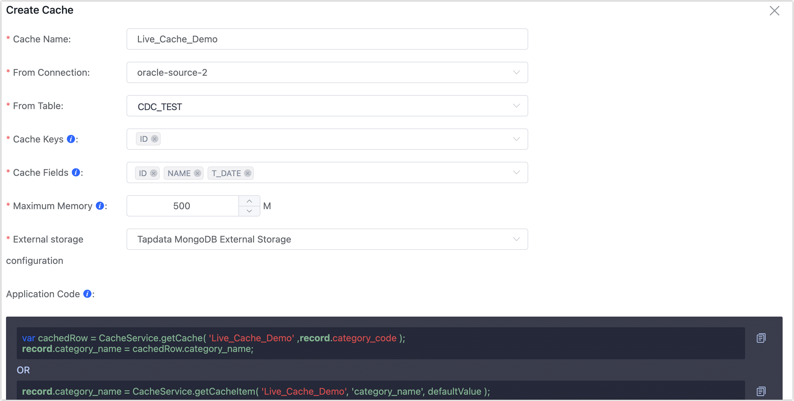
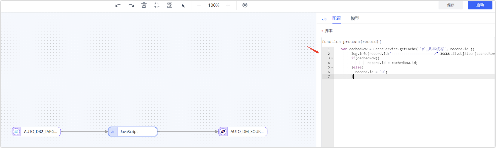

# Create Live Cache

import Content from '../../reuse-content/_enterprise-and-community-features.md';

<Content />

Live Cache is primarily designed to alleviate the pressure on the source database by multiple tasks processing some hot data. By placing these data in the cache, it can be used by multiple tasks.

## Create Live Cache

1. [Log in to Tapdata Platform](../log-in.md).

2. In the left navigation bar, select **Advanced** > **Live Cache**.

3. On the right side of the page, click **New Cache**.

4. In the pop-up dialog, complete the configuration according to the instructions below.

   

   * **Cache Name**: Required, supports Chinese and English.
   * **Form Connection**: Choose a connection you want to cache.
   * **From Table**: Choose the table you want to cache.
   * **Cache Keys**: Choose one or more fields as the primary key to identify data for caching.
   * **Automatic Index Creation**: Turn on this feature will automatically create indexes for cache keys in the source table, which may impact the source database's performance.
   * **Cache Fields**: Select the commonly used fields you need to cache.
   * **Maximum Memory**: The maximum memory amount the system will save, exceeding it will delete the least frequently used data based on call time.
   * **External Storage Configuration**: Choose external storage, you can [create external storage](../manage-system/manage-external-storage.md) separately for the cache to store related data.
   * **Application Code**: Generated based on the information filled in, can be copied and used in the JS node of the task to use this cache.

5. Click **Save**.

6. (Optional) For the configured live cache, you can select it and export a backup or share it with other team members. You can also import live cache configurations.
   

## Use Shared Cache

Users can use the cache in the task's JS node. First, click the cache name, then click the copy button on the right side of the application code to copy the cache code for later use.


Create a development task that needs to use the cache.

Select a JS node, click the node, and enter the previously copied code. After pasting, write the processing logic you need to execute.


After all configurations are filled in, click the save button to complete the creation.

## Application Scenario

When synchronizing some data from source tables to target tables, you might need to interact with data from another third table. If you directly retrieve data from the database in the JS, it could be time-consuming and put a lot of pressure on the database if many tasks are started at the same time. Now, users can write a part of the commonly used data from the third table into the live cache for various tasks to call and process.

**Operation Idea:**

First, create a live cache, choose a connection as the cache middleware, copy the application code below, and finally create a development task in the JS node, pasting these codes, connecting the source and the target.

**Specific Process:**

1. Log in to Tapdata Platform, select **Advanced** > **Live Cache** in the left navigation bar.

2. Create a live cache.

   1. Click the **New Cache** button in the upper right corner, configure the information as follows:

      * Cache Name: Can be named arbitrarily, for example, test04.

      * From Connection: Choose a mongo as the cache data source, that is, store data from this library into the live cache for other tasks to use.

      * From Table: Choose a table to transfer data into the cache.

      * Cache Keys: Choose fields as the cache key, aiming to uniquely identify each piece of data.

      * Cache Fields: Choose the fields you want to cache.

        Other fields are not mandatory.

   2. Copy the **Application Code** below; it will be used when creating a task.

   3. Click the **save** button below, which will redirect you to the live cache interface.

3. Open Data Pipeline-Data Conversion, click the **Create Task** button in the upper right corner.

4. Choose a connection as the source node.

5. Drag a JS node and paste the previously copied application code into it.

6. Choose a connection as the target node.

7. After connecting the source node-JS node-target node, click the **Save** button in the upper right corner.

8. Click the return button in the upper left corner to redirect to the task list page.

9. Click the start button for the task to initiate a task using the live cache.



**JS Code**: (The logic is to print cache logs to see if the data has reached the cache)

```java
function process(record){
// Enter your code here
       var cachedRow = CacheService.getCache('lyl_shared_cache', record.id);
       log.info(record.id+"--------------------->"+JSONUtil.obj2Json(cachedRow));
       if(cachedRow){
                record.id = cachedRow.id;
       }else{
          record.id = "0";
        }
        return record;
}
```

Data in MongoDB

