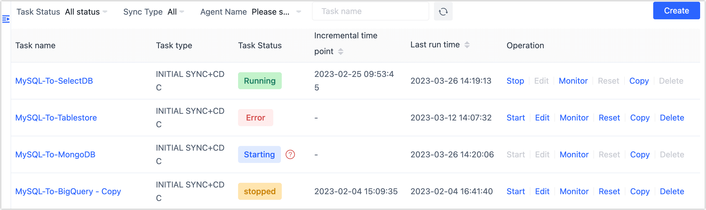

# Manage Data Replication Task

import Content from '../../../reuse-content/_all-features.md';

<Content />

Once the replication task is created, you can monitor and manage it in the task list.

| Operation | Description |
| ----------------- | ------------------------------------------------------------ |
| **Set Tag** | Click the  icon at the top left of the task list to expand the tag information. You can quickly set tags by clicking and dragging the task name to the desired tag. |
| **Set category** | Choose the target task and categorize it based on the business perspective.  |
| **Start**/**Stop** | After stopping the task, the next start will continue to replicate the data based on the last stopped incremental point in time. |
| **Edit** | Configure the task, including node settings, synchronized tables, task start schedule, and other information. Please note that the task cannot be altered during execution. |
| **Monitor** | View the running progress, running logs, connections, history, synchronized content, and more. For more information, see [monitor data replication task](monitor-task.md). |
| **Copy** | Clear the data synchronization progress of the task, and the next start will initiate the data synchronization task from the beginning. |
| **Reset** | Clear the data synchronization progress of the task, and the next start will restart the data synchronization task.  |
| **Delete** | Please note that once a task is deleted, it cannot be recovered. Please proceed with caution when deleting tasks. |
