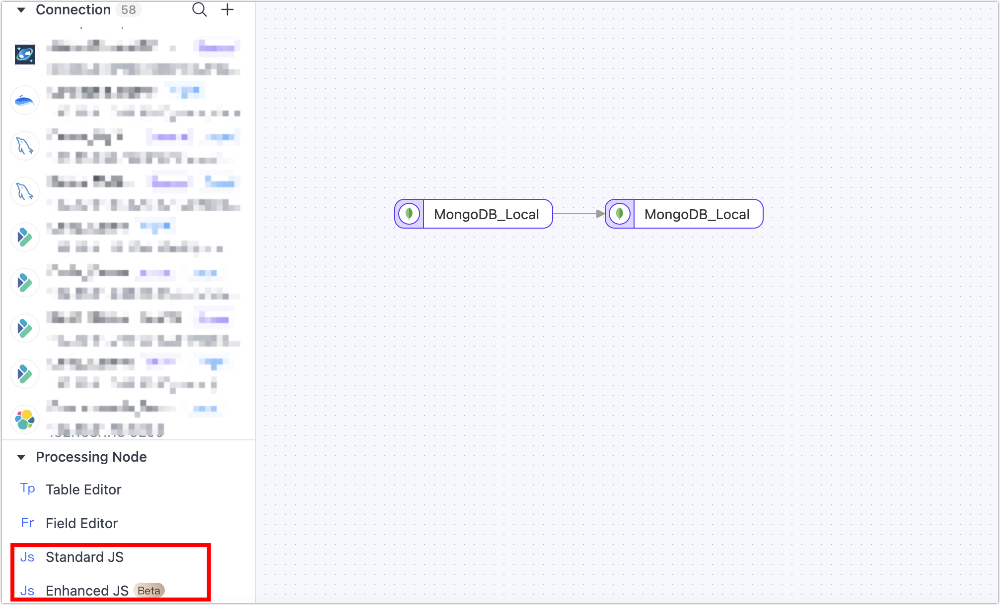

# Adding Processing Nodes to Replication Tasks

Tapdata supports integrating processing nodes into data replication tasks for requirements like data filtering or field adjustments.

## Table Edit Node

The table edit node primarily adjusts table names. Add a **Table Edit** node to the canvas and connect it with the data source. Click on the node to select operations (apply to all tables):

- Rename Tables
- Adjust Table Name Case
- Add Prefix/Suffix to Table Names

Additionally, you can directly specify a new name for individual target tables.


## <span id="column-modification">Column Edit Node</span>

The column edit node mainly renames or changes the case of table fields. Add a **Column Edit** node to the canvas and connect it with the data source. Click on the node to select a uniform method for field name handling (apply to all tables). You can also click directly on the target field name to manually adjust individual fields:

- Convert to Upper Case: e.g., from `claim_id` to `CLAIM_ID`
- Convert to Lower Case: e.g., from `CLAIM_ID` to `claim_id`
- Convert Snake Case to Camel Case: e.g., from `CLAIM_ID` to `claimId`
- Convert Camel Case to Snake Case: e.g., from `claimId` to `CLAIM_ID`

Additionally, you can select a target field and click **Mask** to exclude it from being passed to the next node.


## JS Node

Supports data manipulation using JavaScript scripts or Java code. Ensure the node is connected to both the source and target nodes before editing the code. If not connected, code editing is not possible.



After scripting, use the test button below the node to view inputs and outputs, aiding in debugging.

### JS Node Model Declaration

For JS nodes, Tapdata employs sample data run tests to infer the node's model information. If the inferred model is inaccurate or missing fields, model declaration can be used to explicitly define field information.


The model declaration in replication tasks supports the following methods:

```javascript
// Add a field if it doesn't exist
TapModelDeclare.addField(schemaApplyResultList, 'fieldName', 'TapString')
// Remove an existing field
TapModelDeclare.removeField(schemaApplyResultList, 'fieldName')
// Update an existing field
TapModelDeclare.updateField(schemaApplyResultList, 'fieldName', 'TapString')
// Update or add a field
TapModelDeclare.upsertField(schemaApplyResultList, 'fieldName', 'TapString')
// Set a field as primary key
TapModelDeclare.setPk(schemaApplyResultList, 'fieldName')
// Unset a primary key
TapModelDeclare.unsetPk(schemaApplyResultList, 'fieldName')
// Add an index
TapModelDeclare.addIndex(schemaApplyResultList, 'indexName', [{'fieldName':'fieldName1', 'order': 'asc'}])
// Remove an index
TapModelDeclare.removeIndex(schemaApplyResultList, 'indexName')
```

### JS Built-in Function Explanation

- [Standard JS Built-in Functions](../../../appendix/standard-js.md): Useful for data record manipulation and calculation, such as converting date strings into Date objects.
- [Enhanced JS Built-in Functions (Beta)](../../../appendix/enhanced-js.md): On top of standard JS functions, supports external calls (e.g., network, database).

## <span id="time-calculation">Time Operations</span>

In scenarios where source and target databases are in different time zones, operations on date/time fields, like adjusting hours, are necessary. This requirement can be fulfilled using a time operation node.

**Scenario Example**:

In this case, the source database is in UTC+8, and the target database is in UTC+0, with an 8-hour difference.

**Operational Process**:

1. Log into the Tapdata platform.
2. Navigate to **Data Pipeline** > **Data Replication** and click **Create**.
3. Drag the source and target data sources to the canvas, followed by a time operation node, and connect them sequentially.
4. Configure the source node and select the tables.
5. Click on the **Time Operation** node and in the right panel, select the time type and operation method.

   

    - **Node Name**: Defaults to the connection name, but you can set a meaningful name.
    - **Select the time type to operate on**: Tapdata auto-detects supportable time types. You should choose based on your business requirements. Additionally, you can click the **Model** tab to see the relationship between time types and column names.
    - **Select the operation method**: Supports adding or subtracting time, in integer hours. In this case, we choose to subtract 8 hours.

6. Complete the configuration for the target node and the task. For specific steps, see [Creating a Data Replication Task](create-task.md).

**Result Verification**:

Query the same ID data from both the source and target tables, and you'll notice that the time has been adjusted by 8 hours as set.

```sql
-- Source table query result
SELECT birthdate FROM customer_new WHERE id="00027f47eef64717aa8ffb8115f1e66a";
+-------------------------+
| birthdate               |
+-------------------------+
| 2021-09-01 09:10:00.000 |
+-------------------------+
1 row in set (0.00 sec)

-- Target table query result
SELECT birthdate FROM customer_new_time WHERE id="00027f47eef64717aa8ffb8115f1e66a";
+-------------------------+
| birthdate               |
+-------------------------+
| 2021-09-01 01:10:00.000 |
+-------------------------+
```

## Type Filtering

In scenarios involving data synchronization between heterogeneous data sources, some data types not supported by the target database might also lack business utility. In such cases, the **Type Filtering** node can quickly filter out unwanted same-type columns. The filtered fields will not be passed to the next node.

Operation: Add the **Type Filtering** node to the canvas and connect it to the data source. Click on the node and select the field types to filter (precision specification is not supported yet).


:::tip

Precision specification for filtered field types is not yet supported. For instance, if the field type to be filtered is **varchar**, then **varchar(16)**, **varchar(12)**, etc., will all be filtered.

:::