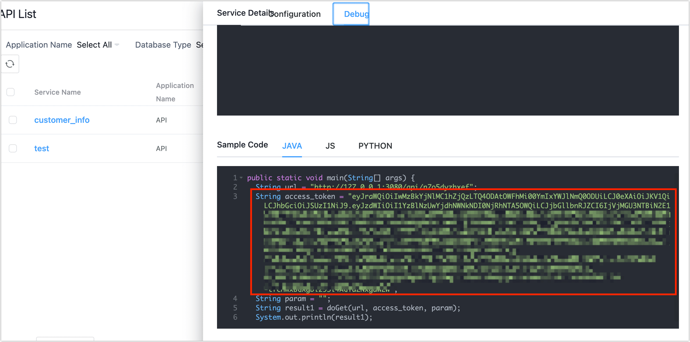

# Query API via GraphQL

GraphQL provides a query language that allows you to request data from the server in a declarative way, such as specific data in a schema. Tapdata has integrated GraphQL, allowing you to execute requests through the API service address.

In this article, we will introduce how to use the Postman tool to view API data services through GraphQL.

## Procedure

1. Log in to Tapdata.

2. Retrieve the GraphQL query request address.

   1. In the left navigation bar, select **Data Services** > **API Servers**.

   2. Obtain the API server's access address on this page. In this case, it's `192.168.1.200:3080`.

      

   3. In your browser, enter the API server’s access address and add the `/graphql` suffix, e.g., `http://192.168.1.200:3080/graphql`, to get the GraphQL query request address.

3. Get the Access Token authentication information for the API service.

   1. In the left navigation bar, select **Data Services** > **API List**.

   2. Locate and click on the target service name.

   3. In the panel on the right, click the **Debug** tab, scroll down to the example code section to get the Access Token authentication information.

      

4. Open the [Postman tool](https://www.postman.com/), and click **Workspaces** at the top of the software page, and select your Workspace.

5. Click **New**, and in the pop-up box, choose **GraphQL Request**.

   

6. In the Request URL text box, enter the GraphQL query request address you retrieved in step 2.

7. Click **Authorization** below the text box, choose **Type** as **Bearer Token**, and fill in the Access Token authentication information obtained in step 3.

   

8. Click on the Query tab, first click the refresh button to get all API lists, then find the target API, select the data you want to query, and finally click **Query**.

   

   :::tip

   You can confirm the correspondence between API name and service name in the **Service Access** section by clicking on the target service and scrolling down in the **Service Management** page on Tapdata.

   :::

   Upon successful query, the result of this query will be returned at the bottom of the page, as shown below.

   