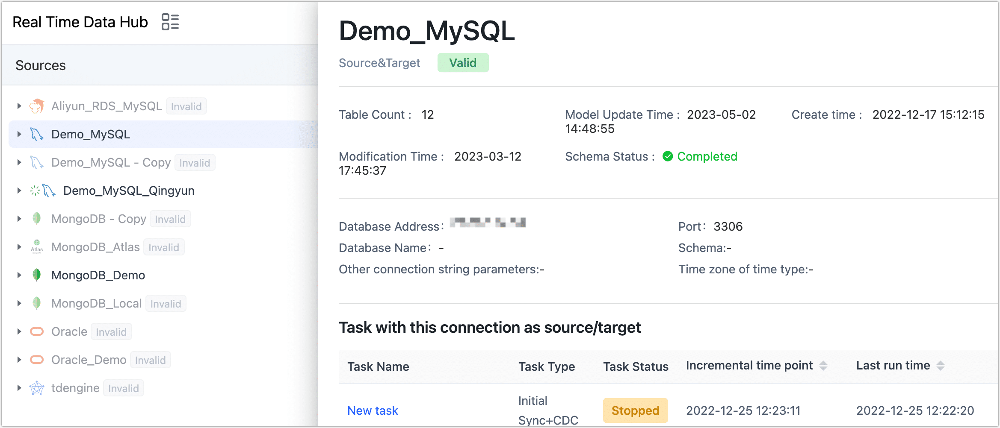

# DaaS Dashboard
import Content from '../../../reuse-content/_enterprise-and-cloud-features.md';

<Content />

Once the data service platform mode is activated, the page will be organized according to the previously mentioned [hierarchy](enable-daas-mode.md). You can effortlessly drag the table to the next level, which will automatically create data replication tasks and streamline the data flow.

This article provides a comprehensive guide on utilizing the Data Service Platform Mode interface, enabling you to swiftly grasp the functionality of the various modules.


```mdx-code-block
import Tabs from '@theme/Tabs';
import TabItem from '@theme/TabItem';
```

## Procedure

1. [Log in to Tapdata Platform](../../log-in.md).

2. In the left navigation panel, click **Real-Time Data Hub**.

3. On this page, you can conveniently view the information you have entered for your data source. In the following sections, we will explain the functions of each button available.

   

```mdx-code-block
<Tabs className="unique-tabs">
<TabItem value="① Switch View Model">
```
Click the </img> icon allows you to view the data source information in the form of a directory structure. You can navigate through the directory structure to select a specific table.

In the catelog view, if you select a specific table, you can also see table details on the right-hand side of the page. The introduction to each tab is as follows:
</img>

* **Overview**: Provides essential information about tables, including table size, row count, column types, column descriptions (sourced from comments by default), sample data, and more.
* **Schema**: Offers in-depth insights into table columns, encompassing details like column types, primary keys, foreign keys, default values, and more.
* **Tasks**: Displays associated tasks for the table, along with their respective statuses. This tab also enables the creation of new tasks.
* **Lineage**: Presents data lineage relationships visually through a graph format, aiding in effective data quality management. Clicking on a task node allows direct navigation to the monitoring page of the relevant task.
	</img>

</TabItem>

<TabItem value="② Add Data Sources">
Click the </img> icon, in the pop-up dialog, we can add a data source, select a data source will jump to the connection configuration page. For more information, see <a href="../../../prerequisites">Connect Data Sources</a>.
</TabItem>

<TabItem value="③ Search Tables">
Click the </img> icon allows you to enter a keyword for the table name, enabling you to quickly navigate to the specific table. This feature is also supported in other Layers.
</TabItem>

<TabItem value="④ Data Source Detail">
On the right side of the data connection, clicking the </img> icon,will display the connection information and associated tasks of the data source on the right side of the page.


</TabItem>

<TabItem value="⑤ View Table Lineage">
Clicking on this icon allows you to explore the lineage of the table, revealing the chain of relationships that led to the creation of this data table. This feature assists you in effectively managing your tables.


</TabItem>

<TabItem value="⑥ View Related Tasks">
Clicking on the </img> icon, you can view all related data synchronization tasks for this data source, along with their operational statuses and other relevant information.
</TabItem>
</Tabs>
