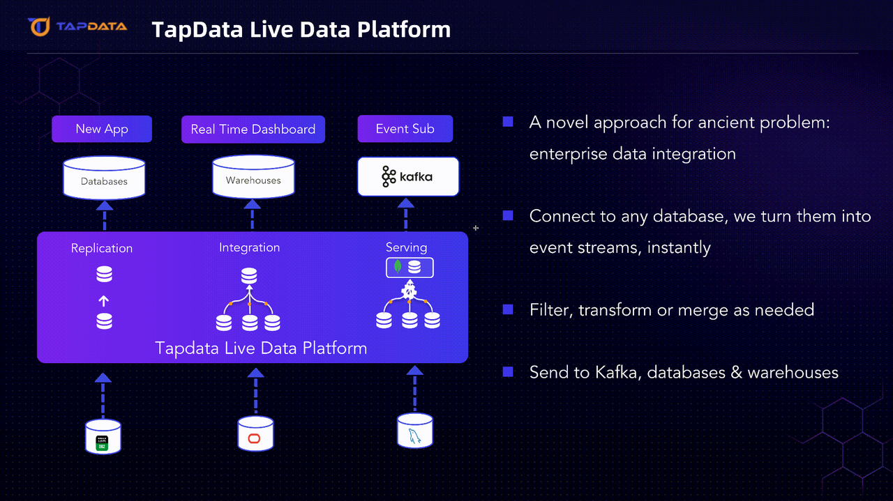

# What is TapData?

TapData is a near real time data platform designed for all your data applications that require low latency, fresh data. 

At its core, TapData is a CDC-based real time data integration platform. However, what makes it different, is its design for bundling common data storages to provide a seemless experence for building a more complete data platform solution, such as real time data warehouse, real time data hub etc. 
 
## Where Would You Use TapData?

Some of the most common applications enabled by TapData

* **Real time data pipelines and replications** between different databases, as an alternative to Kafka based ETL pipelines. 

* **Real time data warehouse** to support real time analytics, dashboards to assist in time decision making. 

* **Centralized data service**  connecting and consolidating data from various operational systems, then serve operational applications via built-in RESTful API or reverse ETL. 

## How It Works?

## Why Choose TapData?

* **[Milliseconds Low-latency Performance](user-guide/advanced-settings/share-mining.md)**

  TapData is built with the principle of low latency. Based on proprietary CDC log parsing technology, it enables near real time data collection with zero intrusion and virtually no impact on the source databases. Each row of data or event that enters the platform is responded to, computed, processed, and written into the target database or centralized data store within seconds range. 

* **[Consistency Guarantee](user-guide/data-pipeline/verify-data.md)**

  Ensures high consistency between target data and source data through various proprietary technologies, supports multiple verification methods, and meets the stringent requirements of production environments.
  

* **[No-code/Low-Code Experience](user-guide/workshop.md)**

  If you are the ones who don't like SQL and writing code to get your data, TapData is built for you! Simply drag-and-drop and you can quickly data replciation and data transformation tasks. In the event drag & drop is not sufficient, we provide UDF (User-Defined Functions) based on Javascript and Python, to enable sophisticated data processing logic. 

 
* **[Comprehensive Data Source Support](introduction/supported-databases.md)**

  Supports most of the mainstream databases, cloud databases, SaaS applications, file data sources. You may also custom build your own source / target connectors using our Plugin Development Kit.
 

* **Materialized View Updated in Real Time**
  
  It is easy to build materialized view to speed up the query performance with any database. But keeping the materialized view up-to-date with its backing sources is complex and expensive. TapData's multi-table stream join allows you to easily built a materialized view, fully automatic. 

    
## What Are the Typical Use Cases?

**Database Replication**

**Data Integration**

**Query Acceleration**

**Customer Data Platform**

**Order & Inventory Consolidation**

**Fraud Detection, Anomoly Detection**

**Real Time Monitoring & Alerting**

**Quality Monitoring**

 

## How Does TapData Compare To XXX?

**Airbyte**

  Both are data integration tool, reasons for considering TapData: 1) Low latency is your primary consideration 2) You want a more complete data solution with data storage

**Debezium**

  Debezium is more like a library, TapData is a more complete product. Both are based on CDC technology,  TapData has a lot more features: transformation, join, caching, data storage etc. 

**FlinkCDC**

  FlinkCDC is great fit if you are already using Flink. Otherwise, it may be too much a baggage of the big data suite if your purpose is primarily on data integration.  

## New to Tapdata?

No worries, with TapData's GUI , follow our [Quick Start](quick-start/README.md) tutorial, and you can easily get started in just a few minutes. Moreover, we have prepared a wealth of tutorials to help you quickly meet your data flow requirements.

 

:::tip

While browsing the documentation, please pay attention to the "**Applicable to**" badge at the top of each document to ensure the information you read corresponds to the version you have deployed.

:::

## See also

- [Product Architecture and Workflow](introduction/architecture.md)
- [Features](introduction/features.md)
- [Use Cases](introduction/use-cases.md)
- [Supported Databases](introduction/supported-databases.md)
- [FAQ](faq/README.md)
