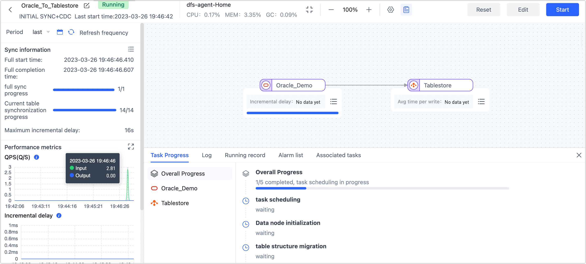

# Oracle to Tablestore Real-Time Sync

Alibaba Cloud [Tablestore](https://help.aliyun.com/document_detail/27280.html) is a serverless table storage service for large amounts of structured data, while providing a one-stop IoT store solution for the depth optimization of IoT scenarios. With Tapdata Cloud, Oracle can be synchronized to Tablestore in real time, making it easy to achieve data flow and better meet data architecture changes or big data analysis scenarios.

## Preparations

Before you create a replication task, make sure you have configured the relevant data source:

1. [Configure Oracle Connection](../user-guide/connect-database/certified/connect-oracle.md)
2. [Configure Tablestore Connection](../user-guide/connect-database/alpha/connect-tablestore.md)

Also note the reference [data type support](../user-guide/no-supported-data-type.md).

## Configure Task

1. Log in to [Tapdata Cloud](https://cloud.tapdata.net/console/v3/).

2. In the left navigation panel, click **Data Replications**.

3. On the right side of the page, click **Create** to configure the task.

4. On the left side of the page, drag the Oracle and Tablestore data sources into the right canvas and connect them.

5. Click the Oracle data source, select the table you want to synchronize in the right panel, and then click the Tablestore data source to view the synchronized data structure.

   

   :::tip

   Since the number of columns in a single table in Tablestore cannot exceed 32, if the number of columns in Oracle to be synchronized tables exceeds 32, you need to drag a **Field Edit** node from the left of the page, connect it as an intermediate node between Oracle and Tablestore, and then block business-independent columns in the **Field Edit**. For more information, see [Processing Node](../user-guide/data-development/process-node.md).

   :::

6. After confirming the configuration is correct, click **Start**.

   After the operation is completed, you can observe the performance of the task on the current page, such as QPS, delay, task time statistics, etc.

   

## Task Management

On the Task List page, you can also start, stop, monitor, edit, copy, reset, and delete tasks.

For more information, See [Management Tasks](../user-guide/copy-data/manage-task.md).