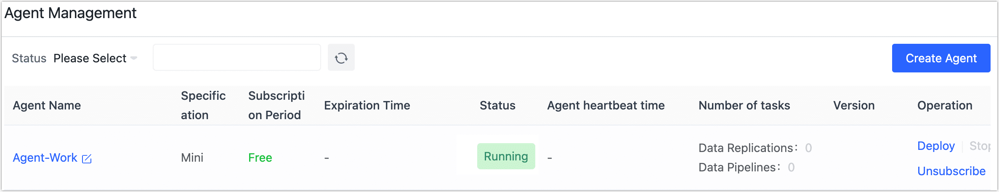
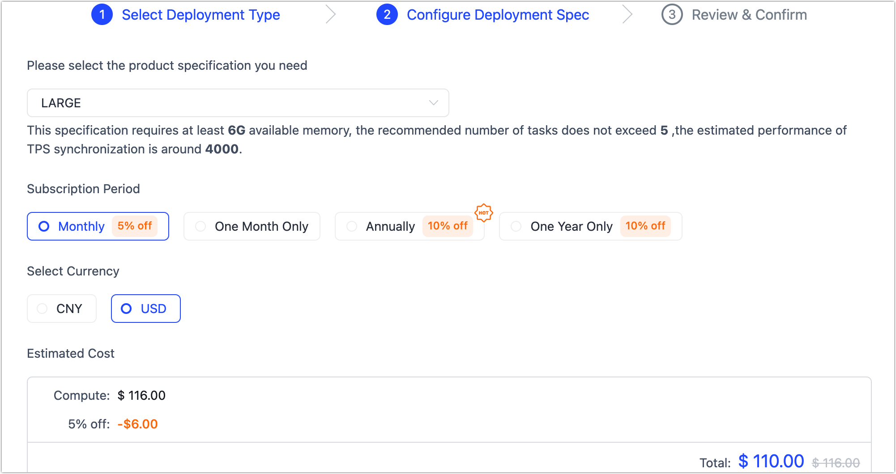
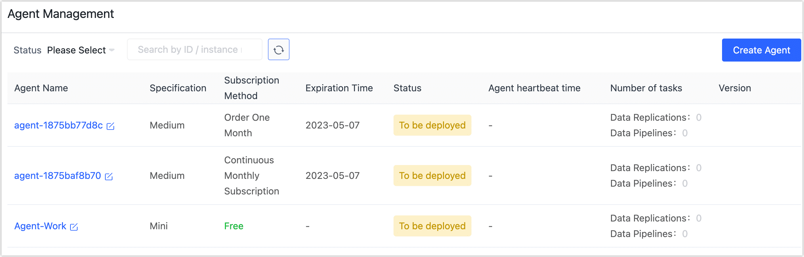

# Subscription Instance

After registering Tapdata Cloud, you can create one Agent instance for free, and if you want to create more agents or higher transfer performance, you can follow the flow of this article to complete the subscription of the instance.

## Procedure

1. Log in to [Tapdata Cloud](https://cloud.tapdata.net/console/v3/).

2. In the left navigation panel, click **Agent Management**.

   We've created a free Agent instance, and now we need to subscribe to more Agent instances to meet the performance needs of the business.

   

3. On the right side of the page, click **Create Agent**.

4. In the pop-up dialog, select **Semi Managed Mode** and click **Next**.

   :::tip

   In **Semi Managed Mode**, you can [deploy Agent](../quick-start/install-agent/README.md) on an existing device, making full use of the existing hardware resources to get lower prices while further improving security. In addition, you can also purchase/try Tapdata Cloud through [Alibaba Cloud Marketplace](https://market.aliyun.com/products/56024006/cmgj00061912.html), and after obtaining an authorization code in Alibaba Cloud Marketplace, enter it at the bottom of this page to complete the binding.

   :::

5. In the **Configure Deployment Spec** tab, select information such as Agent specification and subscription method.

   

   * **Product specifications**: Select product specifications based on the number of tasks and performance requirements required for evaluation. You can create an example of **SMALL** specifications for free. For detailed descriptions of product pricing and specifications, see [Billing Overview](billing-overview.md).
   * **Subscription method**: Select the required subscription method, in order to avoid the expiration of the instance affecting the execution of the task, it is recommended to choose the Annually (**10% off**) or Monthly (**5% off**).
   * **Select currency**: Currently supports CNY or USD.

6. Click **Next**, confirm the specifications to be purchased, the billing method, confirm the email address where you received the bill, and then click **OK**.

7. On the payment page that you are redirected to, follow the instructions on the page to complete the payment process, and you can download the payment credentials after completing the payment.

8. After the payment is successful, return to the Tapdata Cloud platform to see that the Agent instance you purchased is **To be deployed**.

   Next, you can deploy the Agent on your server. For more information, see [Install Agent](../quick-start/install-agent/README.md).

   
