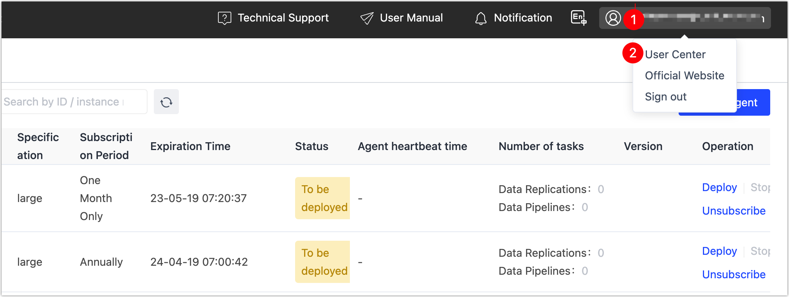

# Renew Instance

For annual/monthly instances, Tapdata Cloud will remind you to renew in time one month before the expiration. In order to avoid affecting your business, please renew in time before the expiration of the instance or choose the **continuous annual**/**monthly** billing method at the time of purchase.

## Procedure

1. Log in to [Tapdata Cloud](https://cloud.tapdata.net/console/v3/).

2. In the top-right corner of the page, click your username and select **User Center**.

   

3. Scroll down to the bottom of the page, and in the **Service Subscription Information** area, you can see your current subscription information.

4. Locate the target Agent instance and click **Renew**. If your instance is on a continuous annual/monthly subscription, there is no need to perform this operation.

   

5. On the payment page that you are redirected to, follow the instructions on the page to complete the payment process.

