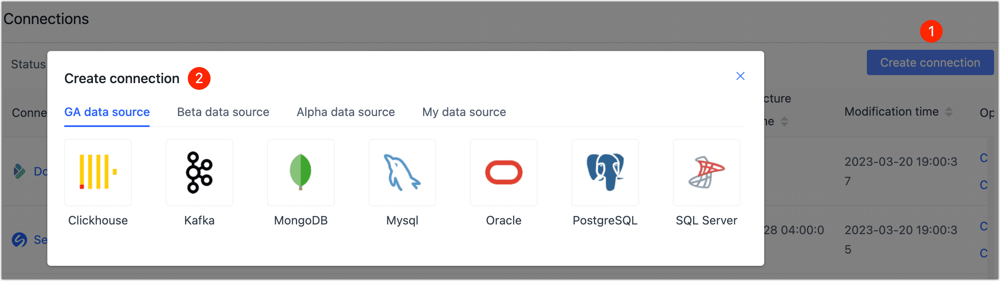
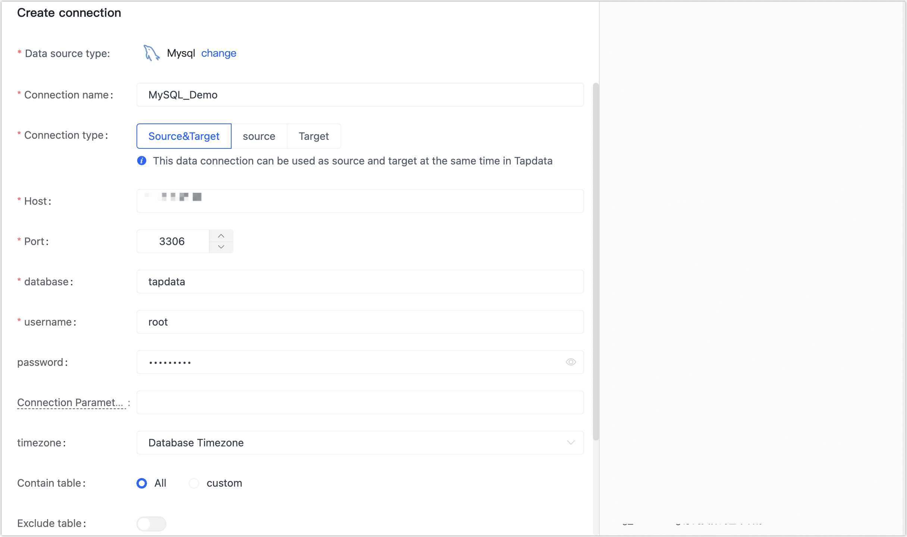

# Step 2: Connect Data Sources

Once you have [installed the Agent](install-agent), you need to connect the Agent to the data sources through Tapdata Cloud, and you can create a data pipeline once the connection has been established.

:::tip

Before connecting to the data sources, you also need to ensure that the network environment is accessed properly and complete the authorization of the database account. For more information, see [Preparation](../prerequisites/README.md).

:::

## Procedure

1. Log in to [Tapdata Cloud](https://cloud.tapdata.net/console/v3/).

2. In the left navigation panel, click **Connections**.

3. Click **Create connection** on the right side of the page, and in the dialog that pops up, select the data source you want to connect to.

   

4. In the pop-up dialog, fill in the data source connection information, and the right panel will prompt for connection configuration help information.

   :::tip

   The operation process will be demonstrated using MySQL as an example. For more examples, see [Connect Data Sources](../user-guide/connect-database/README.md).

   :::

   

   * **Connection name**: Fill in a unique name that has business significance.
   * **Connection type**: Select Source, Target, or Source&Target.
   * **Host**: The database connection address.
   * **Port**: The service port of database.
   * **Database**: database name, a connection corresponding to a database, if there are multiple databases, you need to create multiple connections.
   * **username**: The database account.
   * **Password**: The database password.
   * **Connection Parameter String**: Additional connection parameters, default empty.
   * **timezone**: Defaults to the time zone used by the database, which you can also manually specify according to your business needs.
   * **Contain table**: Defaults to **all**, you can also choose to custom and fill in the included tables, separated by commas (,) between multiple tables.
   * **Exclude tables**: After turning on the switch, you can set the tables to be excluded, separated by commas (,) between multiple tables.
   * **Agent settings**: Defaults to **Platform automatic allocation**, you can also manually specify an agent.

5. Click **Connection Test** at the bottom of the page, and when passed the check, click **Save**.

   :::tip

   If the connection test fails, follow the prompts on the page to fix it.

   :::

## Next step

[Create a Data Pipeline](create-task)