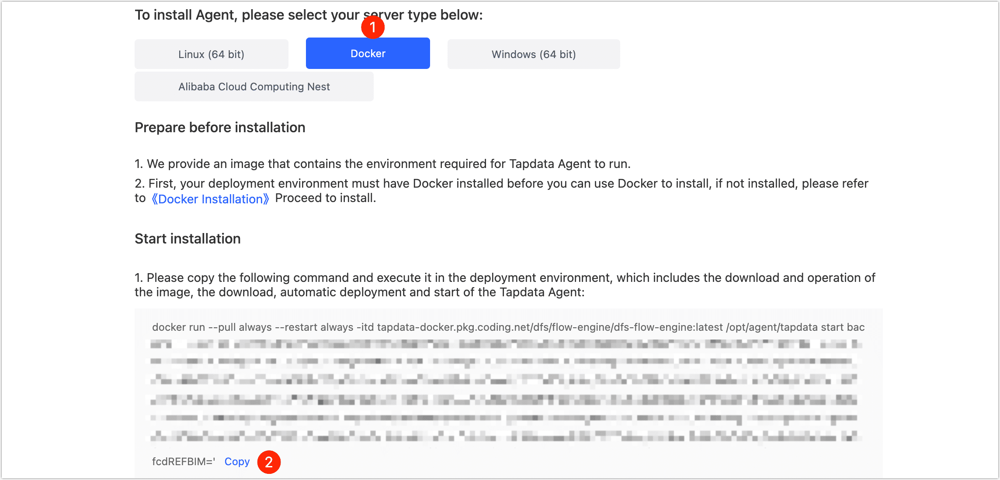

# Install on Docker

Tapdata Agent (short for Agent) obtains data from the source, processes and transmits it to the target, and supports multi-platform installation. This article describes how to install Agent on the Docker platform.

## Requirements

- CPU: x86 Architecture Processor
- Operating System: 64-bit
- Network: Ability to connect to the public network and communicate with the source/target database
- Software:[ Docker](https://docs.docker.com/get-docker/)

:::tip

To simplify the installation process, Tapdata provides you with a Docker image with a Java environment (version 1.8). For additional images, please contact your Docker image administrator or visit the [Docker website](https://hub.docker.com/search).

:::

## Install Agent

1. Log in to [Tapdata Cloud](https://cloud.tapdata.net/console/v3/).

2. Click **Agent** in the left navigation panel, and then click **Create Agent** on the right.

3. On the Agent download and installation page, select **Docker** and copy the installation command.

   

4. Log in to the device where the Agent will be deployed (without root privileges), create a folder first (e.g., tapdata) and enter it for easier management of the Agent.

5. Paste and execute the installation command you copied in step 3, which contains the process of downloading, deploying, and launching the Agent, and print the container ID after the launch is successful, as shown in the figure below.

   

## Next step

[Connect Database](../connect-database.md)

## See also

* [Manage Agent](../../user-guide/manage-agent.md)
* [FAQ about Agent](../../faq/agent-installation.md)
