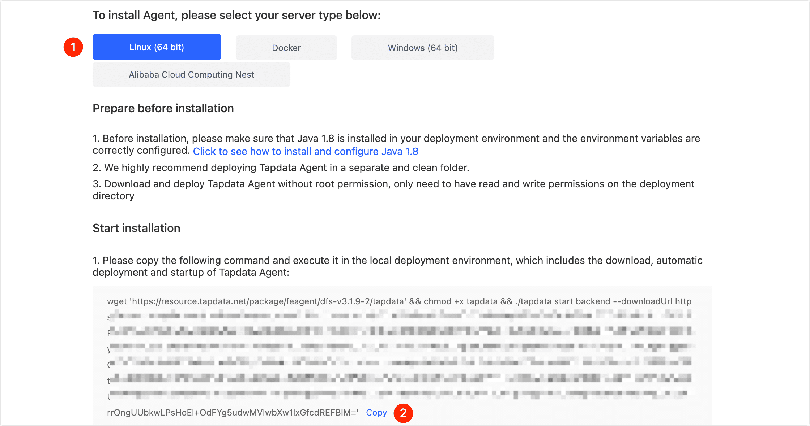

# Install on Linux

Tapdata Agent (short for Agent) obtains data from the source, processes and transmits it to the target, and supports multi-platform installation. This article describes how to install Agent on the Linux platform.

## Requirements

- CPU: x86 Architecture Processor
- Operating System: 64-bit
- Network: Ability to connect to the public network and communicate with the source/target database
- Software: Java 1.8

:::tip

You can view the Java version by executing the `java-version` command on your device. If you do not install it, you need to install the Java environment manually. For example, execute the command: `yum -y install java-1.8.0-openjdk`.

:::

## Install Agent

1. Log in to [Tapdata Cloud](https://cloud.tapdata.net/console/v3/).

2. [Create an Agent](../../billing/purchase.md) according to business requirements.

3. After completing the subscription, select **Linux(64 bit)** on the **deployment page** that you are redirected to, and then copy the installation command.

   

4. Log in to the device where the Agent will be deployed (without root privileges), create a folder first (e.g., **tapdata**) and enter it for easier management of the Agent.

5. Paste and execute the installation command you copied in step 3, which contains the process of downloading, deploying, and launching the Agent, and the launch success is shown in the figure below.

   

## Next step

[Connect Data Sources](../connect-database.md)

## See also

* [Manage Agent](../../user-guide/manage-agent.md)
* [FAQ about Agent](../../faq/agent-installation.md)
