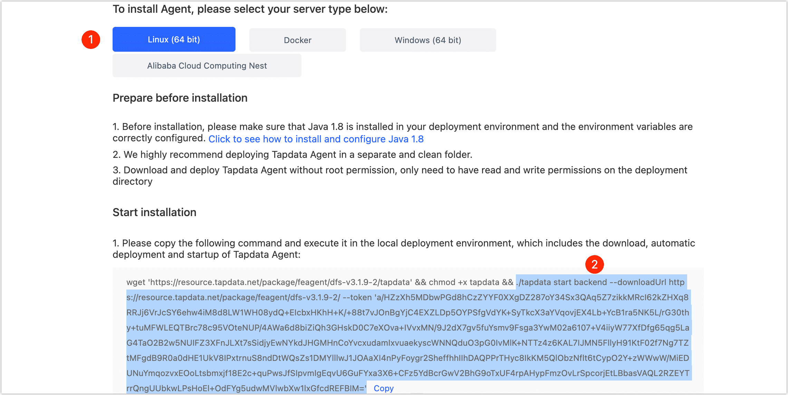

# Install on Mac (M1 Chip)

Tapdata Agent (short for Agent) obtains data from the source, processes and transmits it to the target, and supports multi-platform installation. This article describes how to install Agent on the Mac platform (M1 chip).

## Requirements

- Network: Ability to connect to the public network and communicate with the source/target database.
- Software: Dokcer, for more information, see [Install docker](https://docs.docker.com/desktop/install/mac-install/).

## Install Agent

1. Open the Mac's terminal, then execute the following command to download and launch the JDK image.

   ```shell
   # Download Image
   docker pull openjdk:8u312
   # Run Image
   docker run -t -d openjdk:8u312
   ```

2. Execute `docker ps` to get the container ID, and then execute the following format of the command to enter the container command line, for example:

   ```shell
   docker exec -it Container-ID /bin/bash
   ```

   :::tip

   Replace the Container-ID in the command, such as `docker exec -it 1dbee41b4adc/bin/bash`.

   :::

3. To manage the Agent easily, create a folder (e.g., **tapdata**) and enter it by executing the following command.

   ```shell
   mkdir tapdata&&cd tapdata
   ```

4. In the container command line, execute the following command to download the Agent program and unzip it.

   ```shell
   wget 'https://resource.tapdata.net/doc-source/tapdata.zip' && unzip tapdata.zip
   ```

5. Log in to [Tapdata Cloud](https://cloud.tapdata.net/console/v3/) to get Agent-initiated configuration information.

   1. Click **Agent** in the left navigation panel, and then click **Create Agent** on the right.

   2. On the redirected deployment page, select **Linux (64 bit)** and copy the configuration command (start copying from**./tapdata**), as shown in the example.

      

6. Return to the container command line, paste the command you just copied and execute it, and the startup is successful as shown in the figure below.

   


## Next step

[Connect Data Sources](../connect-database.md)

## See also

* [Manage Agent](../../user-guide/manage-agent.md)
* [FAQ about Agent](../../faq/agent-installation.md)

