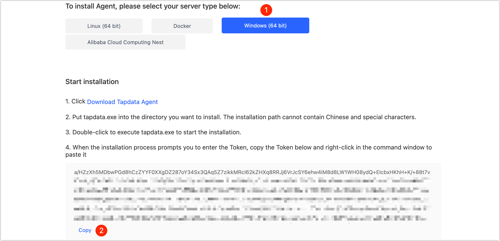

# Install on Windows

Tapdata Agent (short for Agent) obtains data from the source, processes and transmits it to the target, and supports multi-platform installation. This article describes how to install Agent on the Windows platform.

## Requirements

- CPU: x86 Architecture Processor
- Operating System: 64-bit
- Network: Ability to connect to the public network and communicate with the source/target database
- Software: Java 1.8

:::tip

You can view the Java version by executing the `java-version` command from the command line on your Windows device. For more information, see [install Java](https://www.java.com/en/download/manual.jsp).

:::

## Install Agent

1. Log in to [Tapdata Cloud](https://cloud.tapdata.net/console/v3/).

2. [Create an Agent](../../billing/purchase.md) according to business requirements.

3. After completing the subscription, select **Windows (64 bit)** on the **deployment page** that you are redirected to, click **Download Tapdata Agent** and copy the installation command.

   

4. To manage the Agent easily, we moved the downloaded Agent installer to the installation directory (such as **C:\tapdata**).

5. Double-click the **tapdata.exe**, and according to the prompt, right-click and paste the token information copied in step 3 and press the enter key, and the command window will automatically close after the launch is successful.

6. (Optional) Double-click the **status.bat** in the Agent installation directory to check the status of the Agent. The following is an example of a normal startup.

   

## Next step

[Connect Data Sources](../connect-database.md)

## See also

* [Manage Agent](../../user-guide/manage-agent.md)
* [FAQ about Agent](../../faq/agent-installation.md)
