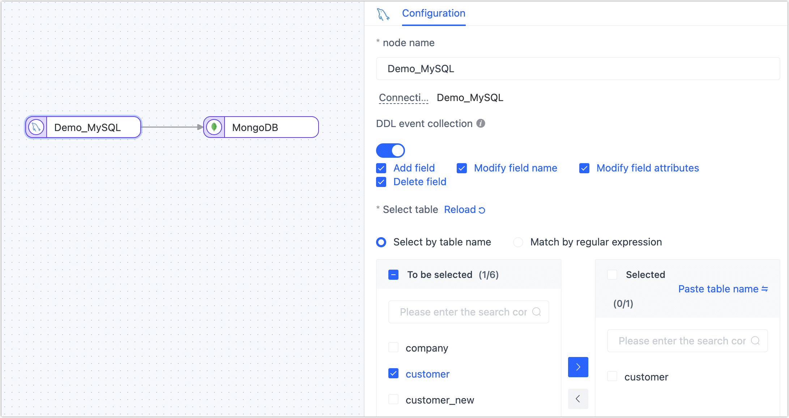

# Create a Data Replication Task

The data replication function can help you to achieve real-time synchronization between the same/heterogeneous data sources, which is suitable for data migration/synchronization, data disaster recovery, reading performance expansion, and other [business scenarios](../../introduction/use-cases.md). 

This article explains the specific data replication process to help you quickly become familiar with creating, monitoring, and managing data replication tasks.

## Prerequisites

Before you create a data replication task, you need to perform the following preparations:

* [Install Tapdata Agent](../../quick-start/install-agent)
* [Connect to a Data Source](../../quick-start/connect-database.md)

## Procedure

As an example of creating a data replication task, the article uses the real-time replication of MySQL to MongoDB, but other data sources can also be used.

1. Log in to [Tapdata Cloud](https://cloud.tapdata.net/console/v3/).

2. In the left navigation panel, click **Data Replications**.

3. On the right side of the page, click **Create** to configure the task.

4. On the left side of the page, drag and drop the source and destination data into the right canvas, and then connect them.

   

   :::tip

   In addition to adding data nodes, you can also add processing nodes to complete more complex tasks, such as filtering data, adding or subtracting fields, etc. For more information, see [processing nodes](../data-development/process-node.md).

   :::

5. Click the source node (MySQL in this example) to complete the parameter configuration of the right panel according to the following instructions.

   

   * **Node name**: Defaults to connection name, you can also set a name that has business significance.
   * **DDL event collection**: After turning on the switch, Tapdata Cloud automatically collects the selected source DDL events (such as new fields), if the target database supports DDL writing, it can achieve DDL statement synchronization.
   * **Select table**: Choose which tables you want to sync.
      * **Select by table name**: Select the table on the left, and then click the right arrow to complete the setup.
      * **Match regular expressions**: Fill in the regular expression of the table name, in addition, when the table added by the source database meets the expression, the table will also be automatically synchronized to the target database.
   * **Batch read number**: The number of records read in each batch during full data synchronization, the default is **100**.

6. Click the target node (MongoDB in this example) to complete the parameter configuration of the right panel according to the following instructions.

   1. Set up the node's basic settings.

      

      * **Node name**: Defaults to connection name, you can also set a name that has business significance.
      * **Number of batch writes**: The number of entries written in each batch during full data synchronization.
      * **Write the maximum waiting time for each batch**: Set the maximum wait time in milliseconds, based on the performance of the target database and the network delay evaluation.
      * **Deduction result**: According to the settings of the source node, Tapdata will write table structure information to the target.

   2. Scroll down to the **Advanced Settings** area to complete the advanced setup.

      

      - **Duplicate processing strategy**: Choose how duplicate data should be handled.
      - **Data write mode**: Keep the default, or select according to business needs.
         - **Process by event type**: Select the data write policy for inserts, updates, and deletes events.
         - **Statistics additional write**: Handles only insert events, discards updates, and deletes events.
      - **Full multi-threaded write**: The number of concurrent threads with full data written, the default is **8**, which can be appropriately adjusted based on the write performance of the target database.
      - **Incremental multi-threaded write**: The number of concurrent threads with incremental data written, which is disabled by default, can be appropriately adjusted based on the write performance of the target database.

7. (Optional) Click the  icon above to configure the task properties.

   * **Task name**: Fill in a name that has business significance.
   * **Sync type**: **Full + incrementtal synchronization** can be selected, or **Initial sync**and **CDC** can be selected separately.In real-time data synchronization scenarios, the combination of full and incremental data copying can be used to copy existing data from the source database to the target database.
   * **Task description**: Fill in the description information for the task.
   * **Advanced settings**: set the start time of the task, incremental data processing mode, number of processor threads, agent, etc.

8. Click **Start**, and you can view the performance of the task on the current page, such as QPS, delay, task event statistics, and other information.

   

## See also

[Monitor or Manage Tasks](manage-task.md)

