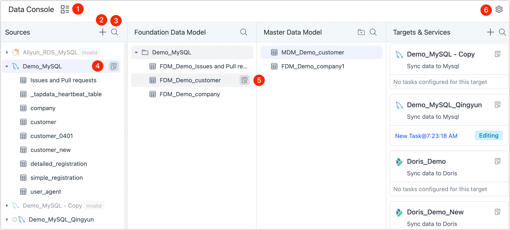

# Data Service Platform Dashboard

After turning on the data service platform mode, the page will be categorized based on [the hierarchy](enable-daas-mode.md) we mentioned earlier. You can simply drag the table to the next level to automatically complete the creation of data replication tasks and easily complete the flow of data. This article explains how to use the Data Service Platform Mode interface to help you quickly understand the various functional modules.

## Procedure

1. Log in to [Tapdata Cloud](https://cloud.tapdata.net/console/v3/).

2. In the left navigation panel, click **Data Console**.

3. You can easily view your entered data source information on this page, and we'll cover the specific roles of each module next.

   

import Tabs from '@theme/Tabs';
import TabItem from '@theme/TabItem';

<Tabs className="unique-tabs">
    <TabItem value="5" label="① Switch View Model" default>

   
Click the </img> icon to display the data source information in the form of a directory structure (click again to switch back to the Data Service Platform view). Select the specific table to view the basic information of the table and the associated task information, including table size, number of rows, column information, sample data, Scheme (such as primary key/foreign key), etc. 

   </img>
   

   </TabItem>
    <TabItem value="1" label="② Add data sources">
    
Click the </img> icon, in the pop-up dialog, we can add a data source, select a data source will jump to the connection configuration page. For more information, see <a href="../../connect-database/">Connect Data Sources</a>. 

   </TabItem>
   <TabItem value="2" label="③ Search Tables">

   
Click the </img> icon to enter a keyword for the table name to help you quickly navigate to the specific table, which is also supported at other Layers. 

   </img>
   </TabItem>
   <TabItem value="3" label="④ Data Source Details">

   
On the right side of the data connection, click the </img> icon, and the right side of the page will display the connection information and associated tasks of the data source. 

   </img>
   </TabItem>
   <TabItem value="4" label="⑤ Table Details">

   
On the right side of the table name, click the </img> icon. On the right side of the page, the basic information of the tasks and tables associated with the table will be displayed, including table size, number of rows, column information, sample data, Scheme (such as primary key/foreign key), etc. This operation can also be used in modules of other layers. 

   </img>
   </TabItem>
   <TabItem value="6" label="⑥ Switch Model">

   
Click the </img> icon, in the pop-up dialog, you can choose to switch back to <a href="../etl-mode/">Data Integration Mode</a>. 

</TabItem>
</Tabs>