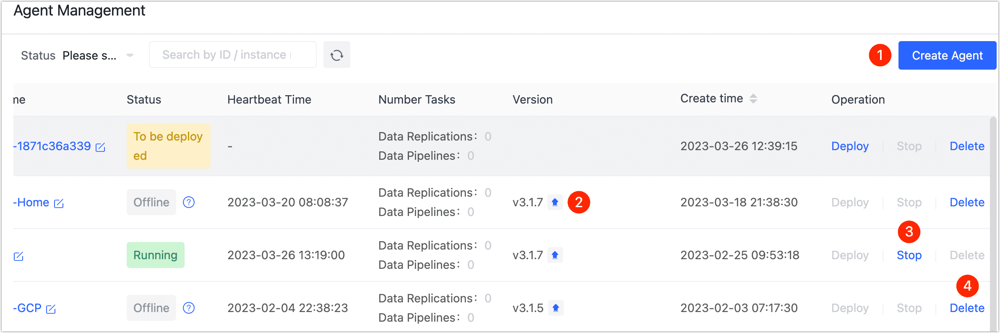

# Manage Agent

Tapdata Cloud supports visual management and maintenance of Agents. You can manage installed Agents via the page or by executing commands.


## Manage Agent by Page

1. Log in to [Tapdata Cloud](https://cloud.tapdata.net/console/v3/).

2. Click **Agent** in the left navigation panel, and then choose which operation to perform.

   


| No. | Operation | Description |
| ---- | ---------- | ------------------------------------------------------------ |
| ① | Create Agent | Agent support multi-platform installation, see [Install Agent](../quick-start/install-agent). |
| ② | Upgrade Agent | When a new version is available, the upgrade icon will appear on the right side of the version information. Click the icon and choose the upgrade method:<br /> ● **Automatic upgrade**: You can choose this method when the Agent status is **running**, and the upgrade icon will disappear automatically after the upgrade is completed. If the upgrade fails, you<br /> can upgrade manually. <br />● **Manual upgrade**: Execute the upgrade command on the Agent's installed device as prompted in the popup. <br />💡 In order to avoid the upgrade operation from affecting the operation of the task, please stop the task related to the agent before upgrading.  |
| ③ | Stop Agent | Click **Stop** to pause the Agent, which can be used for temporary maintenance scenarios, to restart the Agent later, you should run it from the command line.  |
| ④ | Delete Agent | If the Agent is no longer needed, it can be **deleted** after stopping it, and it cannot be recovered after deletion.  |


## Manage Agent by Command

According to the platform selection of the Agent installation, view the relevant command description:

import Tabs from '@theme/Tabs';
import TabItem from '@theme/TabItem';

<Tabs className="unique-tabs">
    <TabItem value="linux" label="Linux" default>
    <p>Enter the installation directory of the Agent, and choose to execute the following command: </p>
    <ul>
    <li>View command help: <code>./tapdata help</code>
 </li>
    <li>Check the status of the Agent: <code>./tapdata status</code> </li>
    <li>Start Agent: <code>./tapdata start</code> </li>
    <li>Stop Agent: <code>./tapdata stop</code> </li>
    </ul>
   </TabItem>
   <TabItem value="windows" label="Windows">
    <p>Enter the installation directory of the Agent, and choose to perform the following operation: </p>
    <ul>
    <li>Check the status of the Agent: Double-click the <b>sstatus.bat</b> </li>
    <li>Start Agent: Double-click the <b>start.bat</b> or <b>tapdata.exe</b> </li>
    <li>Stop Agent: Double-click the <b>stop.bat</b> </li>
    </ul>
   </TabItem>
   <TabItem value="dockerandmac" label="Docker/Mac(M1 Chip)">
    <ol>
    <li>Execute <code>docker ps</code> to get the container ID. </li>
    <p></p>
    <li>Execute the following format of the command to enter the container command line.
    <pre>
    docker exec -it container ID/bin/bash</pre>
    <p>Replace the container ID in the command, such as <code>docker exec -it 1dbee41b4adc/bin/bash</code>. </p>
    </li>
    <li>In the container command line, enter the installation directory of the Agent, and choose to execute the following command:
    <ul>
    <li>View command help: <code>./tapdata help</code>
 </li>
    <li>Check the status of the Agent: <code>./tapdata status</code>
 </li>
    <li>Start Agent: <code>./tapdata start</code>
 </li>
    <li>Stop Agent: <code>./tapdata stop</code>
 </li>
    </ul>
    </li>
    </ol>
   </TabItem>
   <TabItem value="computenest" label="Compute Nest">
    <ol>
    <li>Log in to Alibaba Cloud and enter the <a href="https://computenest.console.aliyun.com/">Computing Nest console</a>.
    </li>
    <p></p>
    <li>Find your Compute Nest instance and click on its ID to go to the Overview page.
    </li>
    <p></p>
    <li>On the <b>Resources</b > tab, locate the ECS instance that the Agent installed (the name contains <b>tapdata</b>), and click the <b>remote connect</b>. <p></p>
    </img>
    </li>
    <p></p>
    <li>In the command window, execute <code>cd/data/tapdata</code> to enter the Agent installation directory, and choose to execute the following command: <ul>
    <li>View command help: <code>./tapdata help</code>
 </li>
    <li>Check the status of the Agent: <code>./tapdata status</code>
 </li>
    <li>Start Agent: <code>./tapdata start</code>
 </li>
    <li>Stop Agent: <code>./tapdata stop</code>
 </li>
    </ul>
    </li>
    </ol>
   </TabItem>
  </Tabs>

### Agent Directory Description
During the installation and execution of the task, the Agent will automatically generate some files in the installation directory for storing task information, logs, configuration files, data source certificates and other information, as detailed below:

tap_table_ehcache: Cache the table's structure of the data source associated with the task runtime.

```bash
├── cert/						 			# Certificate files for the middleware database
├── application.yml							# Agent configuration file
├── CacheObserveLogs/						# Cached monitoring logs
├── components/								# Jar files for engine execution
├── connectors/								# Files related to data source plugins
├── etc/									# Initialization scripts for the middleware database
├── fileObserveLogAppenderV2/				# Observability logs, subdirectories named as task IDs
├── logs/									# Logs generated by the engine during runtime
├── tapdata/								# Agent program
├── tapdataDir/								# Recording the working directory of the engine
└── tap_table_ehcache/						# Cached table models of data sources

```


:::tip

In order to make sure the Agent runs smoothly and quickly locates faults, do not delete the above directory or file.

:::


### Adjust Agent Runtime Memory

Locate the configuration file **application.yml** in the Agent installation directory, edit the file, and adjust the memory configuration according to the available memory of the server, for example, configure it as `tapdataJavaOpts: "-Xms4G -Xmx8G"`, which means that the initial memory is 4G, and the maximum memory is 8G:

```yaml
tapdata:
    conf:
        tapdataPort: '3030'
        backendUrl: 'https://cloud.tapdata.net/api/'
        apiServerPort: ""
        tapdataJavaOpts: "-Xms4G -Xmx8G"
        reportInterval: 20000
        uuid: a5f266a1-a495-412f-a433-29d345713c176
		……
```

After saving the changes, restart the Agent to take effect:

```bash
# Stop Agent
./tapdata stop -f
# Start Agent
./tapdata start
```
