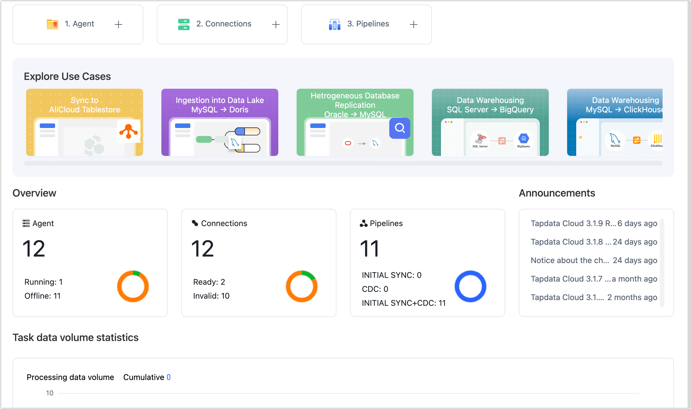

# Dashboard

Through the dashboard, you can quickly learn how the product works and create agents, connections, and tasks.

## Quick Start

Three simple steps to experience Tapdata Cloud's powerful data transfer capabilities:

| Page Button | Description | Related Doc |
| ------------- | ------------------------------------------------------------ | ---------------------------------------------------- |
| ① Agent | Deploy the Agent by following the prompts on the Agent deployment page.  | [Install Agent](../quick-start/install-agent/README.md) |
| ② Connections | Establish a connection between the Agent and the database according to the page prompts.  | [Connect Database](../quick-start/connect-database.md) |
| ③ Pipelines | Create a task that can synchronize data from various data sources to the target database and perform data processing during the synchronization process, such as ETL. | [Create a Data Pipeline](../quick-start/create-task.md) |

## Explore Use Cases

Displays best practices for Tapdata Cloud in different scenarios, such as data into the lake warehouse.

## Announcements

Display the latest announcement information, including upgrade change reminder, version new feature introduction, etc. Click the announcement title to view the details.

## Overview

Displays Agent, Connection, Number of Pipelines, and Status information in Tapdata Cloud.

## Task Data Volume Statistics

Displays the amount of task data per day, which is the total number of inserted, updated, deleted, and DDLs.

## System Notification

Hover your mouse over **Notification** in the upper right corner to quickly get the latest system notifications and alerts (such as Agent status notifications), and you can also click **View all notifications** to go to the **System notification** page and set how Agent notifications (such as Mail/SMS, etc.) work.
